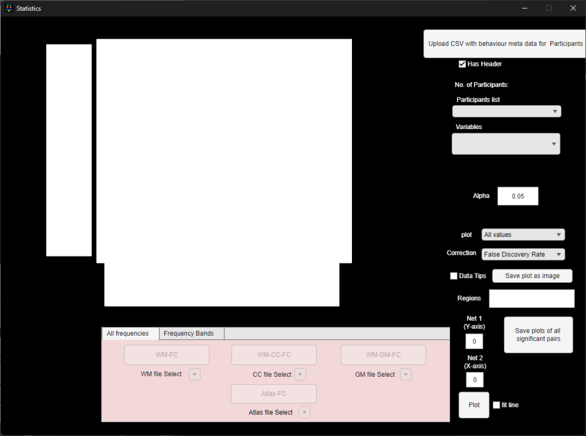
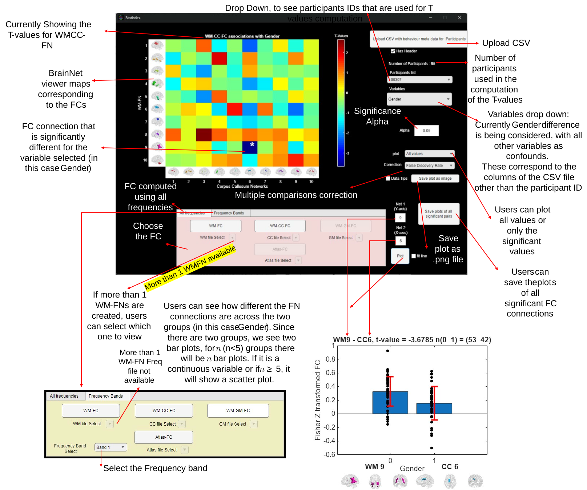

# Analyze Functional Networks and Functional Connectivity

> This module analyses the FNs and FC created during the Construct FNs and FC module by finding significant connections using statistical tests in FCs, checking how symmetric the FNs are across the two hemispheres or comparing the FNs computed by WhiFuN with any other predefined atlas to understand the network labels.

## Compare FNs

> The compare FNs module can be used to compare two sets of FNs. This function compares the FNs based on the Dice coefficient for two sets user specified FNs. This feature is helpful if the user wants to label the FNs by comparing them to a predefined atlas. We explain the working of this module by demonstrating how the WM-FNs generated by WhiFuN can be compared to the JHU-DTI81 atlas (Mori et al., 2008).
>
> When the user clicks the Compare FN button, WhiFuN asks the user to select the first network. Users are expected to select the nifti file corresponding to the first network (See Figure *8‑1*). For instance, we select the WM-FN created by WhiFuN (See Section 7.3 for details) as the first network.

Figure 8‑1: Select the First Network

> Once the user clicks open , WhiFuN asks the user to select the second Network. We select the JHU-DTI-81 atlas (Mori et al., 2008).

Figure 8‑2: Select the Second Network

> Once the user selects open, WhiFuN plots an $n_{1} \times n_{2}$ matrix consisting of the Dice coefficient values calculated between every FN from the first set with that of the second set, where $n_{1}$ is the number of FNs in the first set and $n_{2}$ is the number of FNs in the second set.
>
> Figure 8‑3 Result of Compare FN. Dice coefficients computed between every FN from the first set with that of the second set, where $n_{1}$ is the number of FNs in the first set and $n_{2}$ is the number of FNs in the second set

## Check FN Symmetry

> Using the Check FN Symmetry module, WhiFuN can calculate how symmetric the FNs are between the two hemispheres.
>
> Once the user clicks the Check FN symmetry button, WhiFuN asks the user to select the network whose symmetry is to be computed (.nii file) (See Figure *8‑4*). For instance, we select the WM-FN created by WhiFuN (See Section 7.3 for details)

Figure 8‑4: Select the FN whose symmetry is to be computed.

> To compute the symmetry, WhiFuN cuts the given network into two hemispheres (Left and right).
>
> Once the user selects the network WhiFuN, WhiFuN plots an $n_{1} \times n_{1}$ matrix consisting of the Dice coefficient values calculated between every network in the left hemisphere with that on the right. Where $n_{1}$ is the number of networks.
>
> WhiFuN also calculates the total symmetry of the entire .nii file (Using the method proposed by (Peer et al., 2017) and puts it in the title of the resultant plot (See Figure *8‑5*)
>
> Figure 8‑5: Result of Check FN symmetry. Dice coefficients computed between every network in the left hemisphere with that on the right

## Statistics

> WhiFuN can perform statistical tests (using MATLAB’s regstats function) to find significant differences between groups of subjects or how well a particular FC can explain a behavioral score. To avoid false positives due to multiple comparisons, false rate discovery (FDR) is computed using mafdr (the Benjamin and Hochberg method) or Bonferroni correction computed by correcting the alpha value based on the number of tests that are performed are included in the module.

### 8.3.1 Upload CSV file

> After the WM,GM or CC FNs, or Atlas-FC (See Section 7 for details) is created, users can click on the statistics button to open the WhiFuN statistics module (See Figure *8‑6*).

<figure>

<figcaption>
Figure 8‑6 WhiFuN Statistics GUI
</figcaption>
</figure>

1)  First the user will have to upload a CSV file that has the behavioural meta data that the user wants to analyse. The first column of the CSV file should be Participant ID. Participant ID mentioned in the first column of the CSV should be the same as that of the Participant folder names.

2)  The other columns of the CSV file can be any other metadata such as age, sex, or any other behavioral score. Ensure that except the Participant ID, all other columns should have numerical values. (For instance, for sex, Male can be represented by 0 and Female by 1).

3)  Below we show an example of the CSV file for the practice dataset that has been used here. (Note that these are random sex and age values and not the actual).

| Participant List | sex | age |
|:----------------:|:---:|:---:|
|     0050952      |  0  | 22  |
|     0050953      |  1  | 25  |
|     0050954      |  0  | 26  |
|     0050955      |  1  | 28  |

4)  Users can click on the Upload CSV for Subjects and choose the CSF file (See Figure *8‑7*).

Figure 8‑7: Select CSV file.

### 8.3.2 Statistics Module Features

Once the CSV file is uploaded the FC buttons (at the bottom of the GUI) corresponding to which the time series were stored will be enabled. If any of the buttons are not enabled that means WhiFuN did not find the time series corresponding to that particular FC creation.

1)  Participant list drop down: This drop down shows the Participant IDs of the participant whose data is used in computation of the statistics.

2)  Variables drop down: This drop down shows the variable that is being used to compute the statistical difference (T values) scores. The variables correspond to the columns of the CSV file that was uploaded except the 1st column (Participant ID).

3)  Alpha: This is the significance alpha threshold. Default is 0.05.

4)  Plot drop down: The user can choose to see the Statistics scores for every connection (All values) or only those that are significant (p-values less than Alpha).

5)  Correction drop down: The users can choose the multiple comparisons corrections, the False rate discovery (FDR) (computed using MATLAB function mafdr (the Benjamin and Hochberg method) or Bonferroni correction (computing a new Alpha, by dividing it by the number of comparisons done).

> The number of comparisons is computed by giving the $c$ different p values obtained from every FC element. For WM-FC, if there are $n_{WM}$ WM networks, $c = \frac{n_{wm} \times \left( n_{wm} - 1 \right)}{2}$ , for WM-CC-FC $c = n_{wm}^{2}$ and for WM-GM-FC $c = n_{wm} \times n_{gm}$, where $n_{gm}$ is number of GM networks. For atlas-FC, with atlas having $n_{ROI}$ number of ROIs, $c = \frac{n_{ROI}\left( n_{ROI} - 1 \right)}{2}$.

6)  Data Tips: When this is checked, the user can click on an element in the plot and see the corresponding T-value and p-Value.

7)  Save plot as image: using this the user can save the plot as .png file for publications or posters.

8)  Plot button: Users can see how different the FN connections are across the two groups (in this case sex). Since there are two groups, we see two bar plots, for $n$ (n\<5) groups there will be $n$ bar plots. If it is a continuous variable or if $n \geq 5$, it will show a scatter plot. User has to mention the network number from Y and X axis to get this plot.

9)  Save plots for all Significant pairs: This button will save the above mentioned plot for all the significant FN connections.

10) Frequency Bands: Here the output from the Extract timeseries in specific frequency bands (see section 0) can be analysed.

> See Figure *8‑8* to get a summary of all the features stated above. (We use the HCP 100 unrelated subjects dataset to demonstrate the working of statistics module below)

<figure>

<figcaption>
Figure 8‑8: WhiFuN Statistics module Features
</figcaption>
</figure>
