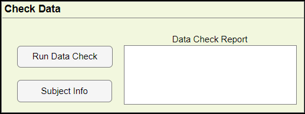
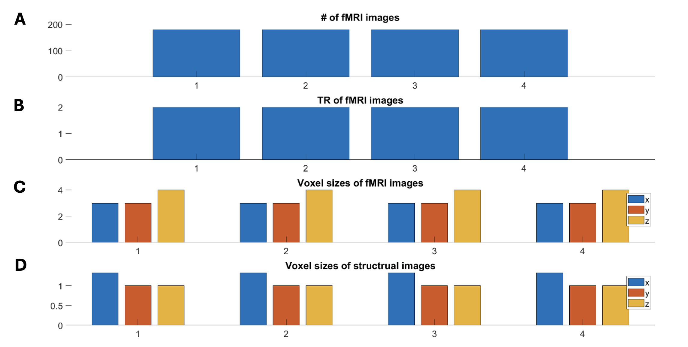
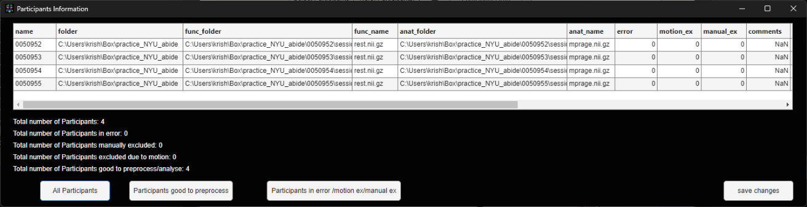

# Check Data

> Once the Setup is complete WhiFuN will check all the paths provided and inform the user of any subject that has missing anatomical or functional files. Additionally, the anatomical and functional voxel sizes, number of time points and Time resolution (TR) of the functional image will also be checked.

## Run Data Check

> Once the Setup is complete the user must click this button to start the data check. This might take some time depending on the number of subjects. Once the check is done, Two plots will be saved in the folder \<Output_folder_path\>/Quality_Control
>
> **Scanning Parameters**
>
> **Q1a_scanning_parameters:** A bar plot of the number of fMRI/functional images/volumes, TR of the functional image, and voxel sizes of the functional and structural image is saved. The user must check that the number of fMRI images/volumes, the TR of the fMRI images and the voxel sizes must be same across the subjects

<table>
<colgroup>
<col style="width: 100%" />
</colgroup>
<thead>
<tr>
<th>

Figure 3‑1: Q1a_scanning_parameters.jpg saved when the practice data set was used. The x axis denotes the subjects. A: Number of fMRI images/volumes B: TR C: Voxel size of fMRI images D: Voxel sizes of structural images, across all subjects.
</th>
</tr>
</thead>
<tbody>
</tbody>
</table>

**Scanning parameters Histogram**

> If the number of subjects is a lot, then the Scanning parameters histogram would be a better choice to see if the MR parameters are consistent across the subjects. Here the user must check that there should be just one histogram bar for every plot. If there are more than one bar for a histogram (e.g. See Figure *3‑1*: Q1a_scanning_parameters.jpg saved when the practice data set was used. The x axis denotes the subjects. A: Number of fMRI images/volumes B: TR C: Voxel size of fMRI images D: Voxel sizes of structural images, across all subjects. D, voxel x dimension of structural MRI image) that means, that particular parameter is not consistent across subjects. In this case the difference is very small (1.329995 and 1.330005) users may ignore this as the difference is very small. But if the difference is large than that particular subject may be discarded.

<table>
<colgroup>
<col style="width: 100%" />
</colgroup>
<thead>
<tr>
<th>
<strong>D</strong>

<strong>C</strong>

<strong>A</strong>

<strong>B</strong>

Figure 3‑2: Q1a_scanning_parameters_histogram.jpg saved when the practice data set was used. Histogram of A: the number of timepoints/volumes/images in the fMRI image. B: TR C: Voxel sizes of fMRI images D: Voxel sizes of structural images.
</th>
</tr>
</thead>
<tbody>
</tbody>
</table>

**Data check Report**

> The data check report mentions the information of any missing files. If the check completes without any problems, Data Check report will state that the Data Check was completed successfully.
>
> WhiFuN reads the TR value from the nifti header. There may be instances where the nifti header is corrupted or the TR value is not present in the nifti header. Data check report will notify the user that the TR corresponding to Subject \<Subject ID\> is not found and the user will have to manually specify the TR for those subjects.

## Participant Info

> Once the Data check is done, User can look at the information extracted from WhiFuN using the Participant Info button.

<table>
<colgroup>
<col style="width: 100%" />
</colgroup>
<thead>
<tr>
<th>

Figure 3‑3: Participant Information extracted from Data check.
</th>
</tr>
</thead>
<tbody>
</tbody>
</table>

The fields in the Subject Info are explained as follows

1)  Name: The Participant name/ID same as the Participant Folder name.

2)  Folder: The Participant Data Folder

3)  func_folder: folder path to the functional nifti file

4)  func_name: full name of the functional nifti file

5)  anat_folder: folder path to the anatomical nifti file

6)  anat_name: full name of the anatomical nifti file

7)  Error: If any error was found for a particular subject, this field will be 1 corresponding to that subject else 0.

8)  motion_ex: During Preprocessing if a particular subject does not meet the motion criteria, then motion_ex will be 1 for that subject else 0.

9)  manual_ex: If any subject was excluded from preprocessing during the setup stage then manual_ex will be 1 for that subject else 0.

10) comments: field foe Quality control check while using the whifun_qcviewer

11) nt: Number of time points/ volumes in the functional image.

12) x_func, y_func, z_func: The x,y,z voxel size of the functional image.

13) x_anat, Y_anat, z_anat: The x,y,z voxel size of the anatomical image.

14) TR: The temporal resolution (TR) of the functional image extracted from the Nifti header.

**Participants good to Preprocess**

If the Participants good to preprocess button is clicked, only the participants that are actually going to be processed will be displayed and not all.

**Participants in error/motion ex/manual ex**

All the participants that wont be processed because of error, motion or manual rejection will be displayed.

**Manual corrections and Save Changes**

Any field in this table can be manually changed and the save changes button can be used to save these changes to the Subj_list.csv file.
