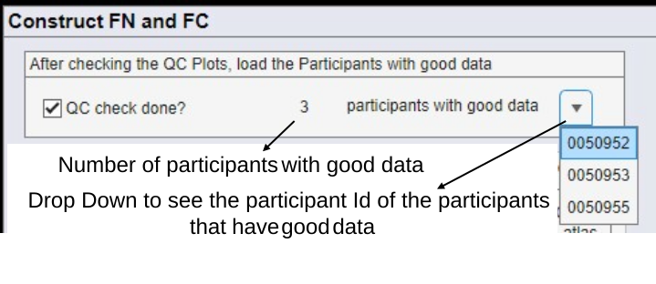
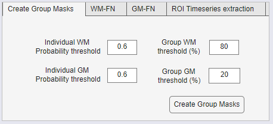
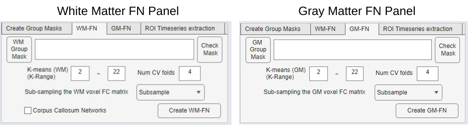
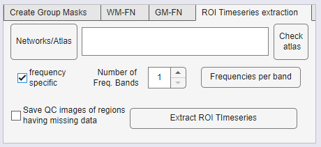

# Construct Functional Networks and Functional Connectivity

> This section discusses how the Functional Networks can be extracted using the K-Means algorithm and Functional Connectivity maps can be generated by storing the average timeseries corresponding to every region in a predefined atlas supplied by the user.

## Make sure QC check is done

> After Preprocessing, the User must go through all the Quality controls plots described in Section 4.9 and reject outlier subjects. Once the QC check is done, the QC check box should be checked. This will load the Participants with good data. (See Figure 7‑1 ).

Figure 7‑1: Make sure the Quality Control plots are checked and participants with good data is loaded.

> Once the user checks the QC check done checkbox, WhiFuN loads the participants with good data (See).

<figure>

<figcaption>
Figure 7‑2: Select All subjects and other details.
</figcaption>
</figure>

## Create Group Masks

> To create the WM and/or GM functional network it is first required to create group level masks that can be used to identify the WM and/or GM voxels respectively. This module creates the Group WM and GM binary masks (See).

|  |
|----|
| Figure ‑: Create Group masks module. |

### 7.2.1 Group Masks thresholds

> The Individual WM/GM probability Threshold and the Group WM/GM threshold (%) are parameters to create the Group WM/GM Masks. These thresholds decide which voxels to consider in the Group WM/GM Masks.
>
> All voxels for which at least Group WM/GM threshold (default 80% for WM and 20% for GM) of participants have WM/GM probability greater than an Individual WM/GM probability Threshold (default 0.6) are included in the group GM/WM mask.
>
> The highest value that the Individual WM/GM probability can take is 1. Higher values will lead to a smaller but more precise WM/GM Mask.
>
> The highest value that the Group WM/GM threshold (%) can take is 100. Higher values will lead to a smaller but more precise WM/GM Mask.

## White matter and Gray Matter Functional Networks

> This module discusses how the WM and GM Functional Networks (FNs) can be created using WhiFuN. This module is applied to the fully preprocessed func images. Using the Group masks to identify the WM or GM voxels across the subjects, the K-means algorithm clusters the voxels in WM and GM to create the WM and GM-FNs based on voxel-based FC (See Figure *7‑4*). Once the FNs are constructed, the averaged time series corresponding to every FN is extracted and stored as .mat files.

Figure 7‑4 Flow Chart of WM/GM FN Construction. $N_{GM} =$number of voxels in GM Mask. $N_{WM} =$number of voxels in WM Mask. $N_{s_{GM}} =$number of voxels in subsampled GM Mask. $N_{s_{WM}} =$number of voxels in subsampled WM Mask.

|  |
|:--:|
| Figure 7‑5 WM and GM FN construction panels. |

### 7.3.1 K-means parameters

> If the user creates the Group masks using the create group mask function, then the Mask field will automatically populate with the Group mask created by WhiFuN. If the User wishes to use another mask, the path of the mask can be provided. The Check Mask function will open an interactive orthosliceviewer figure that can be used to see the mask that will be input.
>
> WhiFuN requires the user to specify a K-value range (default 2 to 22). For every K-value in the range, the average dice coefficient and the distortion value are computed to help the user find the optimal K-value.
>
> If the user inputs the same value for the lower and the higher range (Eg. 6 ~ 6) then WhiFuN will skip the cross validation and directly create clusters with the value mentioned (Eg. 6).
>
> A cross-validation approach is applied to determine the optimal number of clusters (K). The user can specify the number of cross validation (Num CV folds (default 4)).
>
> Subsampling drop down: There are two options available here i) Subsampling and ii) Use entire FC. It is recommended to use Subsampling for most of the cases.

### 7.3.2 Corpus Callosum Networks

> Under the WM-FN tab, there is a checkbox for Corpus Callosum networks. If this is checked, WhiFuN will divide the corpus callosum into sub regions that are maximally correlated to the created WM-FNs. The method proposed by (Wang et al., 2020) is used to create the Corpus callosum networks.

### 7.3.3 Create WM/GM FN

> Once all the parameters are set, users can click on the Create WM-FN or GM-FN button.

1)  WhiFuN will first create the Group WM/GM mask. The Group Masks will be stored in the \<output_folder_path\>/Analysis/Group_Masks as WMmask_allsubjs.nii and GMmask_allsubjs.nii for Wm and GM respectively.

2)  Once the Masks are created, WhiFuN will compute the average voxel-level FC using the data from all the subjects that were selected with good data. Thereafter WhiFuN uses the cross validation approach proposed by (Peer et al., 2017) to find the optimal value of K for the K-Means clustering (this step will be skipped if the user inputs the same value for the lower and the higher range of K values). The timeseries extracted for every voxel in the WM mask is saved in a folder Vox_ts_from\_\<the name of the mask\> . This is done so that if the FN has to be computed again (with a different value of K) in the future, WhiFuN will directly load this saving time. The user may delete this folder (which might save some space) if he does not want to compute the FN again.

3)  After the cross-validation Grid search is complete for all the values of K, WhiFuN will plot a graph of Dice coefficients and Distortion values vs the K values.

4)  WhiFuN will have a pop up asking the user what value of K should be chosen See Figure *7‑6*.

5)  An optimal K-value has a high average dice coefficient and low distortion value. As one can observe from Figure *7‑6*, there are local peaks of Average Dice Coefficients. The K values corresponding to these peaks can be chosen as the optimal K value. These plots are saved as .png files in

> \<output folder\>/Analysis/WM_FN/K_grid_search_dice_coefficient_WM.png
>
> \<output folder\>/Analysis/GM_FN/K_grid_search_dice_coefficient_GM.png
>
> Figure 7‑6: Finding the optimal number of FNs (K value). A: for WM-FNs and B: for GM-FNs. For this example K= 10 and 9 can be chosen as optimal K values for WM-FNs and GM-FNs respectively

6)  Once the optimal K-value is selected, WhiFuN will compute the FNs and store the FN as a .nii file with name WM_FN_K *\<*value of K used*\>.*nii for WM-FNs and GM_FN_K*\<*value of K used*\>*.nii for GM-FNs.

7)  The average BOLD time series of every WM and GM network for every subject are stored in a folder Participant\_\*M_FN_K\<value of K used\>\_avg_ts and WhiFuN also stores 6 views of the GM/WM-FNs in a folder \*M_FN_K*\<*value of K used*\>*\_\_BrainNet_images in

> \<output folder\>/Analysis/WM_FN/WM_FN_K\<value of K used\> for WM
>
> \<output folder\>/Analysis/GM_FN/GM_FN_K\<value of K used\> for GM

8)  If the Corpus Callosum (CC) networks checkbox was checked, the CC-FNs will be stored in

> \<output folder\>/Analysis/Original_Corpus_Callosum/ Original_corpus_callosum_FN_from_WM_K*\<*value of K used for WM-FNs*\>*.nii
>
> The Mask used to identify the Corpus Callosum voxels is taken from Mori atlas (Mori et al., 2008).

9)  The time series from every voxel in the CC mask is stored in the Participant_ts_from_Original_corpus_callosum folder and the average timeseries from every CC_FN is stored in Participant_Original_corpus_callosum_FN_from_WM_K *\<*value of K used*\>*\_avg_ts.

## ROI timeseries extraction

> If users have a predefined atlas and they wish to compute the FC matrix using the atlas, WhiFuN’s ROI timeseries extraction module can be used. This module will extract the average bold timeseries within each ROI specified in the atlas. A corr function in matlab or Display FC module can be used to look at the FC after the average timeseries is extracted.

Figure 7‑7: WhiFuN's ROI timeseries Extraction module.

> Here the user can choose the atlas. WhiFuN has already included JHU type 1, type 2 and type 3 atlases, but the user can also specify any other atlas (.nii file). This atlas file should have integer valued ROIs, for example ROI 1 voxels should have the value as 1, ROI 2 voxels should have the value as 2 and so on. Background and non-brain regions should have the value as 0.
>
> The check atlas function can be used to look at the input atlas.

### 7.4.1 Quality Control for ROI timeseries extraction.

> Once the atlas is specified, the user can opt to save QC images for the subjects that have some NAN or missing values in regions of the atlas. An example of the QC image is shown in Figure *7‑8*. It shows the functional image for a particular subject (in this case Subject 0050952) and Atlas region 19 from the JHU type 2 atlas, with the contour of the atlas region overlapped on the Subject’s functional image. It can be observed that this subject does not have data for few voxels that are in the region. Thus, the number of voxels used to get the average time series of this region for this subject will be less, which can be a problem.

Figure 7‑8: Quality Control for Atlas-FC

### 7.4.2 Extract ROI timeseries

> Once the user Clicks on the Extract ROI timeseries button, WhiFuN will compute the average time series corresponding to every region in the atlas for every subject which can be used to compute the FC matrix using Pearson Correlation (matlab corr function, or to view the FC Display FC module can be used (See Section 9.2)). (See Figure *7‑9*)

Figure 7‑9: Atlas-FC computation

> The average time series is stored as a .mat file for every Participant in
>
> \<output_folder\>/Analysis/ ROI_Timeseries folder.
>
> The user must provide the Atlas which is in the same space and vox size as that of the functional images. If the vox size or space of the specified Atlas is different from that of the functional images, WhiFuN will give an error.

### 7.4.3 Extract Time series in frequency band

> Users can extract the average time series in a particular frequency band, to study the frequency specific characteristics by checking the frequency specific checkbox.
>
> 
>
> Users can specify the atlas and the number of frequency bands. Then by clicking on the Frequencies per band button a new window pops up where the user can specify the different frequency bands and the names corresponding to these frequency bands and click submit. (See Figure *7‑10*)

Figure 7‑10: Frequencies for each band GUI

> QC plots as mentioned in Section 7.4.1 can also be created here by checking the Save QC images of regions having missing data checkbox.

### 7.4.4 Create Average time series

> Once the user clicks the Extract ROI time series button

1)  WhiFuN creates the frequency specific time series in the following folder

> \<output_folder\>/Analysis/ Freq_Specific_ROI_Timeseries /\<atlas_name\>/Participant\_\<atlas_name\>\_avg_ts

2)  The WM/GM and CC FNs created by WhiFuN (see Section 7.3) can also be used here to extract the frequency specific time series.
