
# Getting started

## Download MATLAB Toolboxes

1)  Run MATLAB

2)  Make sure you are in the Home Tab. In the Environment section click on Add-Ons.

> 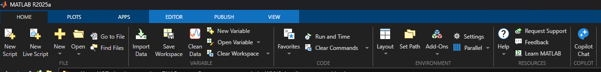
>
> It opens the Add-Ons explorer.
>
> 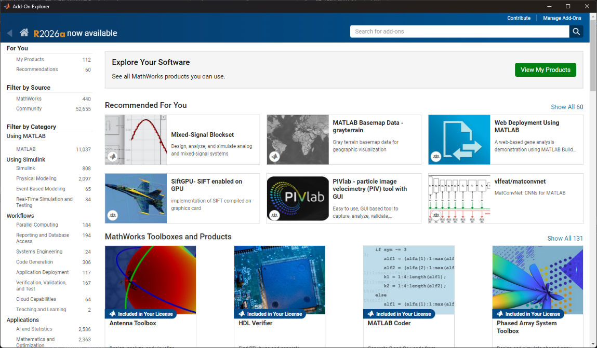

3)  From the search bar, type the names of the following toolboxes and install them in MATLAB.

<!-- -->

1)  Image processing Toolbox

2)  Signal Processing Toolbox

3)  Statistics and Machine Learning Toolbox

4)  Bioinformatics Toolbox

5)  Parallel Computing toolbox (optional but recommended)

## Download SPM and Add path to MATLAB

1)  Download SPM toolbox from (<https://github.com/spm/spm/releases/tag/25.01.02>).

2)  Add path of SPM toolbox by

<!-- -->

1)  By MATLAB Set path ***(Recommended)***

> In MATLAB, make sure you are in the Home tab. In the Environment section, click on Set path.
>
> 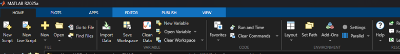
>
> Set Path window opens up.
>
> 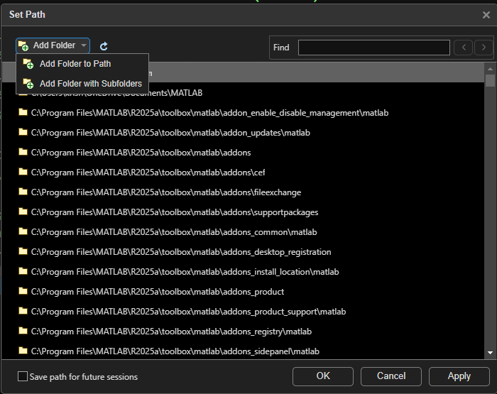
>
> Click on Add folder and Select the SPM folder that has the *spm.m* code
>
> 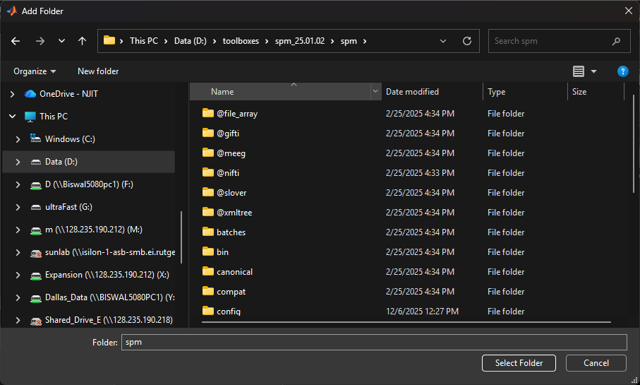
>
> You will see the folder added to the path. You can choose to save path for future sessions and then you would not have to do this again. Finally select apply.
>
> 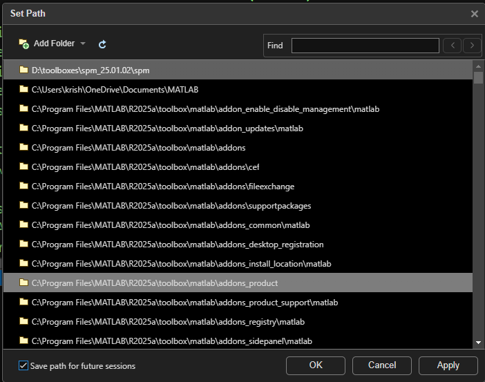
>
> *or*

2)  By MATLAB Command ***(Will have to do every time MATLAB is restarted)***

In MATLAB command window type

addpath('X:\\ ... \spm')

> where, 'X:\\ ... \spm’ is the path of the SPM toolbox on your machine.
>
> Eg.
>
> addpath('D:\matlab_toolboxes\spm)

## Download WhiFuN and Add path to MATLAB

1)  Download WhiFuN from <https://github.com/Brain-Connectivity-Lab/WhiFuN>

> (click on the green code button and, then download zip)
>
> 

2)  Unzip the contents and add path to MATLAB by

3)  By MATLAB Set path ***(Recommended)***

> In MATLAB, make sure you are in the Home tab. In the Environment section, click on Set path.
>
> 
>
> Set Path window opens up.
>
> 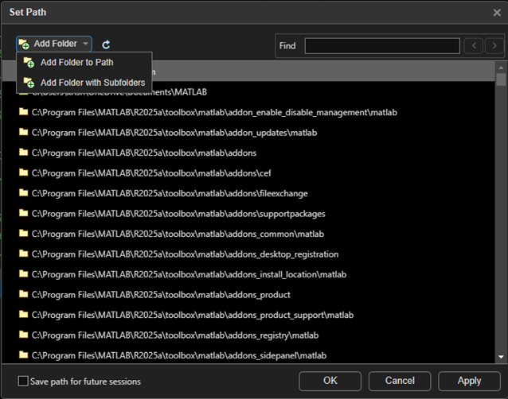
>
> Click on Add folder and Select the WhiFuN folder that has the whifun.m code
>
> 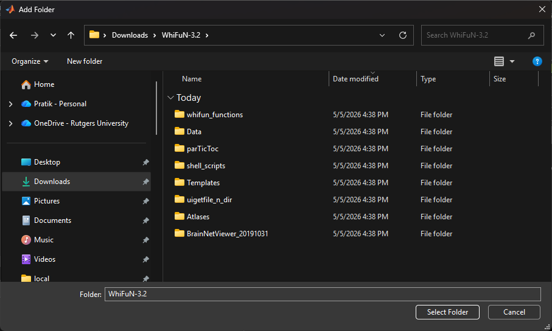
>
> You will see the folder added to the path. You can save path for future sessions and apply the changes.
>
> 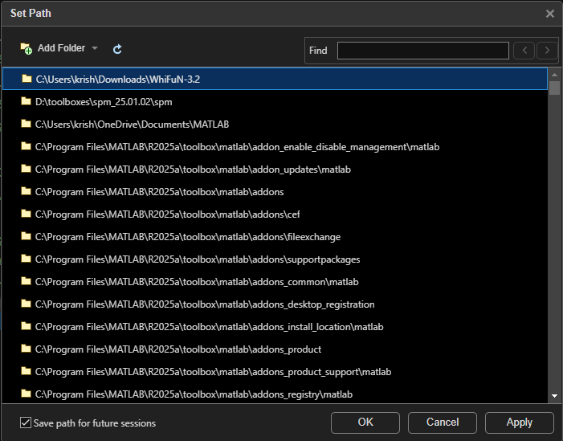

Once all the paths are added, type whifun in the MATLAB command window and the WhiFuN GUI will pop up.

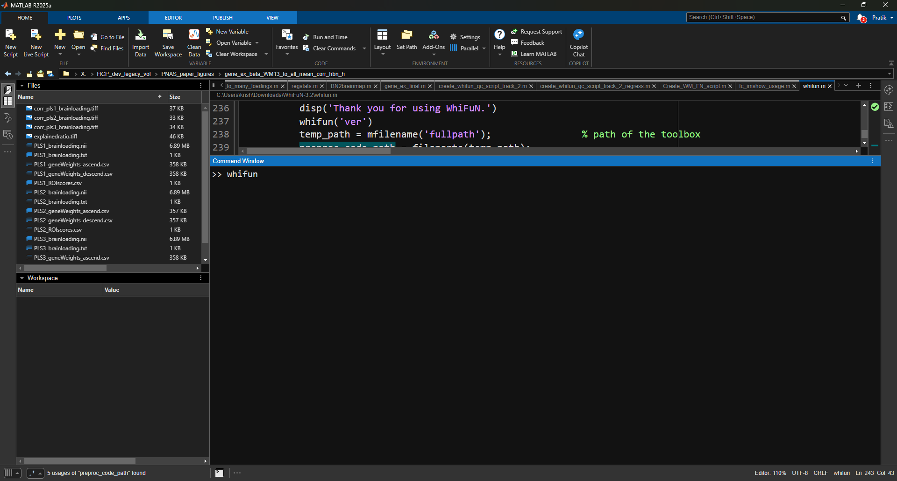

It will display the whifun Version that you are using in the MATLAB command

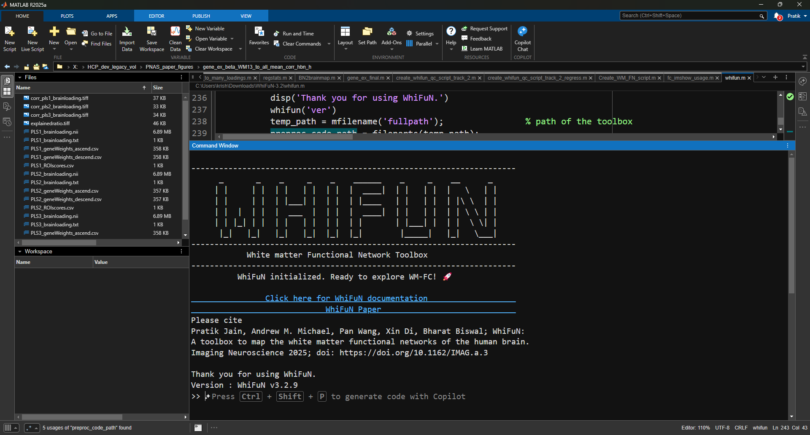

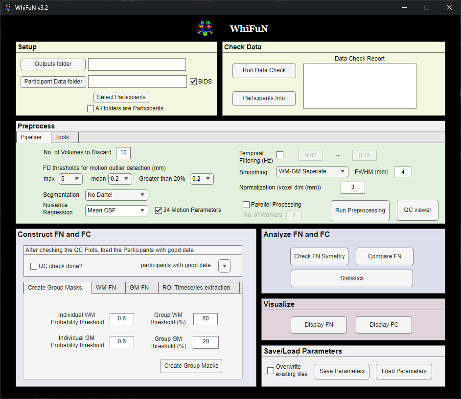
