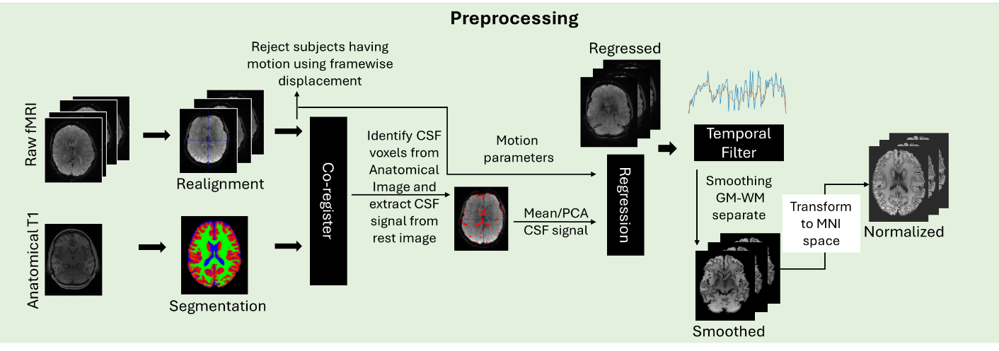
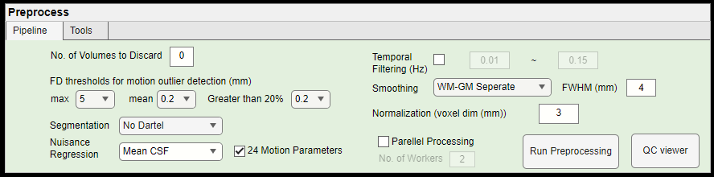
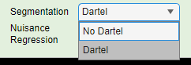
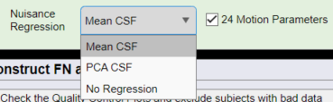
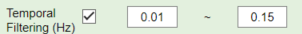
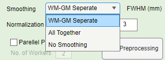

<a id="preprocess"></a>
# Preprocess

WhiFuN uses a combination of inhouse MATLAB scripts and SPM toolbox to preprocess the functional images. Briefly the following steps are executed for preprocessing the images (See Figure *4‑1*). The functional images are realigned to the first volume, motion parameters are computed, and subjects with excessive motion are discarded using the framewise displacement criteria. Then, the realigned functional images are co-registered with the anatomical image, and the anatomical images are segmented. The segmentation generates a CSF tissue probability image from which a CSF mask is generated and used to identify the CSF voxels in the functional images. The mean CSF signal is regressed from the entire brain along with Friston’s 24 motion parameters. After regression, a bandpass filter with a default range of 0.01 – 0.15 Hz filters every voxel time series. The brain's GM and WM regions are then smoothed separately and are finally normalized to standard MNI space. Quality control measures are saved as image files for every subject, which can be used to check if the processing was correct.

<table>
<colgroup>
<col style="width: 100%" />
</colgroup>
<thead>
<tr>
<th><p></p>
<p>Figure 4‑1: WhiFuN Preprocessing Pipeline.</p></th>
</tr>
</thead>
<tbody>
<tr>
<td><p>Figure <em>4‑2</em> shows the Preprocessing GUI of WhiFuN. The parameters related to the different preprocessing steps can be tunned here.</p>
<table>
<colgroup>
<col style="width: 100%" />
</colgroup>
<thead>
<tr>
<th><p></p>
<p>Figure 4‑2: WhiFuN Preprocessing GUI</p></th>
</tr>
</thead>
<tbody>
</tbody>
</table></td>
</tr>
</tbody>
</table>

In the following sections we will go through the preprocessing pipeline in detail and discuss these parameters in detail.

<a id="unzipping-and-discarding-initial-volumes"></a>
## Unzipping and Discarding initial Volumes

> The preprocessing pipeline starts by *‘gun zipping’* any *.gz* file and discarding initial volumes (default is 10) from the functional images, allowing for the magnetization to stabilize to a steady state (Caballero-Gaudes & Reynolds, 2017).
>
> No. of Volumes to Discard --> Expects positive integer values including 0.
>
> If the user specifies 0, No initial volumes will be discarded.
>
> **Output of Discarding initial Volumes**

1)  c\_\<functional image name\>.nii :- Image with the initial volumes discarded as specified by the user. This file will be stored in the folder that contains the functional image.

> If 0 initial volumes were specified to be discarded by the user then, no new image will be generated.

<a id="realignment-and-framewise-displacement"></a>
## Realignment and Framewise Displacement

> The raw functional volumes are realigned to the first image using SPM’s ’*Realign (estimate and reslice)*.’ The head motion associated with each volume is estimated by evaluating how much each volume is transformed to match the first volume.
>
> The following files will be stored in the folder that has the functional file after Realignment is successfully completed.
>
> **Outputs of Realignment**

1)  r\<cut functional image name\>.nii :- Realigned image generated after discarding the initial volumes.

2)  rp\_\<cut functional image name\>.mat :- Motion parameters namely the translations of each volume in x, y, and z directions in millimeters and the rotations of each volume in pitch, roll, and yaw in radians in a text file.

3)  mean\<cut functional image name\>.nii :- Mean functional image is a 3D image with every voxel representing the mean value of the BOLD timeseries.

> **Framewise Displacement**
>
> Using the motion parameters obtained from Realignment the Framewise Displacement (FD) is calculated using the equation proposed by Power and colleagues (Power et al., 2012).
>
> ```{math}
> FD = \left( x_{t} - x_{t - 1} \right)\  + \left( y_{t} - y_{t - 1} \right) + \left( z_{t} - z_{t - 1} \right) + 50\left( {(\alpha}_{t} - \alpha_{t - 1} \right) + \left( \beta_{t} - \beta_{t - 1} \right) + \left( \gamma_{t} - \gamma_{t - 1} \right))
> ```
>
> Where $x_{t},y_{t},z_{t}$ is the translation motion (in cm) in the x, y and z direction and $\alpha_{t},\beta_{t},\ \gamma_{t}$ are the rotational motion parameters (in radians) at timepoint $t$. Here, it is assumed that the head is a sphere with a radius of 50 cm and that the axis of rotation passes through the center of the head. This gives $nT - 1$ FD value for where $nT$ is the total number of time points/volumes in the functional image.
>
> Outlier volumes are identified and corresponding scans are excluded if the maximum FD is greater than a threshold (default is 5mm), if the overall mean FD is greater than a threshold (default 0.2 mm), or if more than 20% of volumes are greater than a threshold (default 0.2 mm) (Parkes et al., 2018).
>
> Once the preprocessing is completed for all subjects, based on the distribution of the FD values WhiFuN allows the user to set the above-mentioned thresholds based on how much motion can be tolerated for a particular cohort (See Section <span class="mark"></span>6.2 [Setup](preprocessing_tools.md#preprocessing_tools)).

<a id="segmentation-co-registration-and-mask-extractions"></a>
## Segmentation, Co-registration and Mask Extractions

> After realignment, WhiFuN performs segmentation and skull striping on the anatomical image. Users can choose if they want to do Dartel Normalization or not at this step as the required files for Dartel normalization are created at the segmentation step.

|  |
|:--:|
| Figure 4‑3: Options for Segmentation |

> For datasets involving a wide age range or datasets that have developmental cohort (children age \< 20 years) are recommended to use the Dartel normalization (Ashburner, 2007).
>
> Next, the functional images are co-registered to the skull-stripped anatomical image to ensure spatial alignment. A cerebrospinal fluid (CSF) mask is then generated, and the BOLD time series within the CSF mask is extracted from the functional images. There are no parameters that the user must define for these steps.
>
> **Output of Segmentation**
>
> Segmentation generates the following files in the folder that has anatomical image.
>
> **Tissue Probability Maps in Subject Space**

1)  c1\<anat image name\>.nii :- The GM tissue probability map in subject space. It is a 3-dimensional image with the same size as that of the anatomical image, with voxel values representing the probability of it belonging to GM.

2)  c2\<anat image name\>.nii :- The WM tissue probability map in subject space. It is a 3-dimensional image with the same size as that of the anatomical image, with voxel values representing the probability of it belonging to WM.

3)  c3\<anat image name\>.nii :- The CSF tissue probability map in subject space. It is a 3-dimensional image with the same size as that of the anatomical image, with voxel values representing the probability of it belonging to CSF.

**Tissue Probability Maps in MNI Space**

4)  wc1\<anat image name\>.nii :- The GM tissue probability map in MNI space. It is a 3-dimensional image with the same size as that of the MNI template, with voxel values representing the probability of it belonging to GM.

5)  wc2\<anat image name\>.nii :- The WM tissue probability map in MNI space. It is a 3-dimensional image with the same size as that of the MNI template, with voxel values representing the probability of it belonging to WM.

6)  wc3\<anat image name\>.nii :- The CSF tissue probability map in MNI space. It is a 3-dimensional image with the same size as that of the MNI template, with voxel values representing the probability of it belonging to CSF.

> WhiFuN also saves the modulated versions of the above mentioned images (mwc\*\<anat image name\>.nii , where \* = 1,2 or 3 for GM, WM or CSF.

**Files required for Normalization to MNI space.**

7)  y\_\<anat image name\>.nii :- Deformation field. This file contains the transformation parameters needed to warp images from the subject’s native space to standard MNI space. It is used for normalizing any image to the MNI template.

8)  iy\_\<anat image name\>.nii :- Inverse Deformation field. This file contains the inverse transformation parameters, allowing images in MNI space to be mapped back to the subject’s native space.

> **Bias Regularized Image**

9)  m\<anat image name\>.nii :- bias regularized image. Removes the smooth spatially varying artifact that modulates the intensity of the image (bias).

> **Files required for DARTEL**
>
> These files will be generated only if the Dartel option was selected.

10) rc\* :- “imported” tissue class images for Dartel where \* = 1,2 or 3 for GM, WM or CSF.

> **Outputs of Skull Stripping**

1)  b\<anat image name\>.nii :- Skull stripped Anatomical image.

> **Output of Co-registration**
>
> The header of the realigned functional image is changed. No new image is generated.

1)  \<Realigned functional image name\>.mat :- A MATLAB variable file, having the new transformation matrix information after the co-registration is done.

> **Outputs of Masks Extraction**

1)  anat_mask\_\*.nii :- Binary mask where voxels inside the brain are labeled as 1 and those outside as 0 (\* is the file name that was used to create the mask).

2)  CSF_MASK0.95.nii :- Binary mask identifying the CSF voxels in subject space. Voxels with CSF probability greater than 0.95 are labeled as 1, while others are 0.

> The following file is stored in the folder where the functional file is present.

3)  Covariance_csf\_\*\_REST.mat :- This is a .mat file that contains the mean/PCA of the CSF BOLD signal (\* indicates the CSF Mask used to Identify the CSF voxels) which is to be regressed during the Nuisance regression step.

4)  func_mask\_\*.nii :- Binary mask in the for the functional image where voxels inside the brain are labeled as 1 and those outside as 0 (\* is the file name that was used to create the mask).

<a id="nuisance-regression"></a>
## Nuisance regression

> To reduce noise, WhiFuN regresses out unwanted signals from every voxel in the brain. Users can choose between regressing the mean CSF signal for a faster computation or using principal component analysis (PCA) to regress the dominant CSF signal components, which is more effective but computationally slower. Alternatively, users may opt to skip CSF signal regression altogether.

<table>
<colgroup>
<col style="width: 100%" />
</colgroup>
<thead>
<tr>
<th style="text-align: center;"><p></p>
<p>Figure 4‑4: Options for Nuisance regression.</p></th>
</tr>
</thead>
<tbody>
</tbody>
</table>

> Besides the dropdown for the Nuisance regression, is the check box for regressing out the Friston’s 24 motion parameters (Friston et al., 1996; Yan et al., 2013). Friston’s 24 parameters are the three translational and three rotational parameters, the squares of them, the derivatives of them, and the squares of the derivatives. Regression is performed to remove the nuisance signals from the rsfMRI time series. If this box is unchecked the motion parameters won’t be regressed out.
>
> If the user decides to use the PCA of CSF signals, then WhiFuN will prompt an additional popup asking for the number of PCA components to regress.

<table>
<colgroup>
<col style="width: 100%" />
</colgroup>
<thead>
<tr>
<th style="text-align: center;"><p></p>
<p>Figure 4‑5: Number of PCA components to regress.</p></th>
</tr>
</thead>
<tbody>
</tbody>
</table>

> **Output of the Nuisance Regression**

1)  Reg\_\<realigned functional image name\>.nii :- Image with the specified confounds regressed.

<a id="temporal-filtering"></a>
## Temporal Filtering

> After Regression, the voxel time series from every voxel is filtered using a Butterworth bandpass filter of second order in the range specified by the user (default 0.01 to 0.15 Hz). The user may choose to skip the filtering step, by unchecking the check box besides Temporal filtering (Hz).

<table>
<colgroup>
<col style="width: 100%" />
</colgroup>
<thead>
<tr>
<th style="text-align: center;"><p></p>
<p>Figure 4‑6: Filter frequency range</p></th>
</tr>
</thead>
<tbody>
</tbody>
</table>

> **Output of the filtering**

1)  f\<regressed functional image name\>.nii :- filtered functional image within the specified frequency bands.

<a id="smoothing"></a>
## Smoothing

> Smoothing is a very important step for WM analysis of BOLD signals. Some criticism in the field is that the GM BOLD signals mix into the WM signals. To completely avoid that WM and GM signals are separately smoothed. WhiFuN also allows the user to use the predefined smooth module for SPM that smooths the WM and GM together, but this is not recommended for WM analysis. Smoothing is performed using a Gaussian kernel with Full with half maximum (FWHM) that can be specified by the user. Moreover, the users may choose not to perform the smoothing step.

<table>
<colgroup>
<col style="width: 100%" />
</colgroup>
<thead>
<tr>
<th style="text-align: center;"><p></p>
<p>Figure 4‑7: Options for Smoothing</p></th>
</tr>
</thead>
<tbody>
</tbody>
</table>

> **Output of the smoothing**

1)  s\<filtered functional image name\>.nii :- Smoothed Image

<a id="normalization-to-mni-space"></a>
## Normalization to MNI space

> Normalization is performed after smoothing, where images are transformed from the subject’s native space to the standard MNI space with a voxel size specified by the user (default: 3 mm). A 3 mm voxel size is commonly used because the after preprocessing, WhiFuN constructs Functional Networks using a voxel-level FC matrix. Using a smaller voxel size (e.g., \<3 mm) increases the number of voxels, which may lead to excessive memory requirements, making voxel-level FC computation challenging.
>
> The deformation field generated during segmentation is used for normalization. The normalization step has a bounding box parameter that determines the field of view of the image with respect to the anterior commissure. The default bounding box parameter set in SPM is slightly expanded to \[-90 -126 -72; 90 90 108\] to ensure that all brain tissue regions are included.

<table>
<colgroup>
<col style="width: 100%" />
</colgroup>
<thead>
<tr>
<th style="text-align: center;"><p></p>
<p>Figure 4‑8: Normalization voxel dimensions.</p></th>
</tr>
</thead>
<tbody>
</tbody>
</table>

> **Output of the Normalization**

1)  w\<smoothed functional image name\>.nii :- Image normalized in the MNI space with the voxel size specified by the user. Stored in the folder where the functional image is stored.

2)  w\<skull stripped anatomical image name\>.nii :- Anatomical Image normalized in the MNI space. Stored in the folder where the anatomical image is stored.

<a id="parallel-processing"></a>
## Parallel Processing

|  |
|:--:|
| Figure 4‑9: Parallel Processing checkbox |

> If parallel processing checkbox is checked, WhiFuN will use the MATLAB parallel processing toolbox to process the participants data parallelly. This can significantly reduce the time taken for preprocessing the participants data. This requires the parallel processing toolbox. See section 1.1 for more details on how to install the parallel processing toolbox.

<a id="error-handling"></a>
## Error Handling

> If WhiFuN encounters any unexpected error while processing a particular paicipant at a particular preprocessing step, it will store the error message in a txt file named \<Participant ID\>\_error_info.txt in the Error_info folder located in the Quality Control folder.
