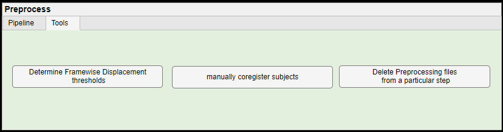
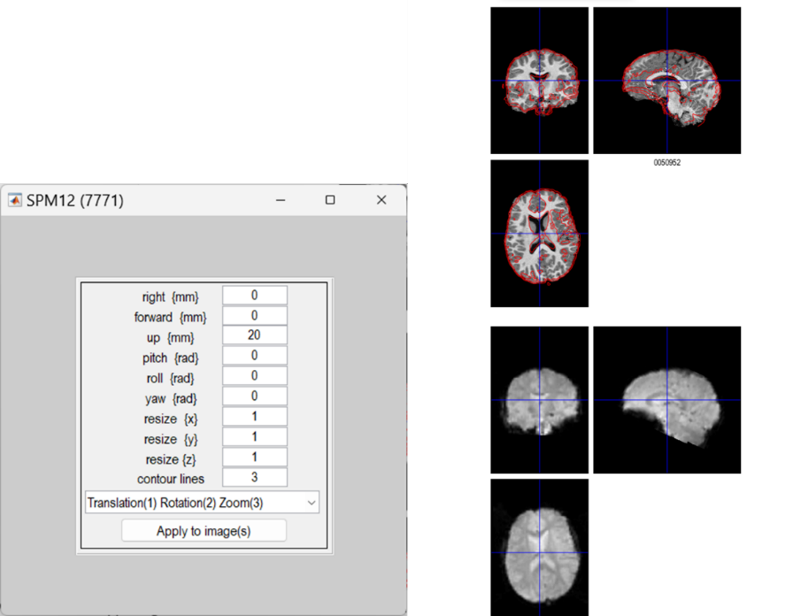
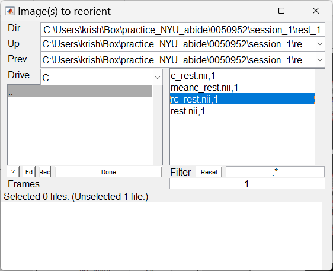
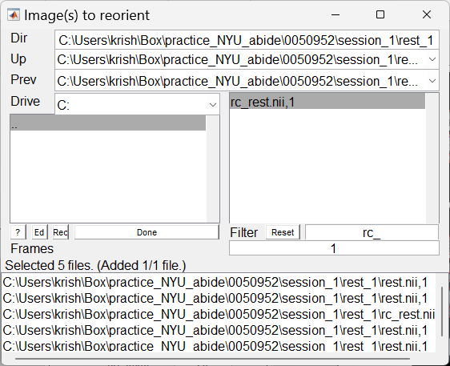
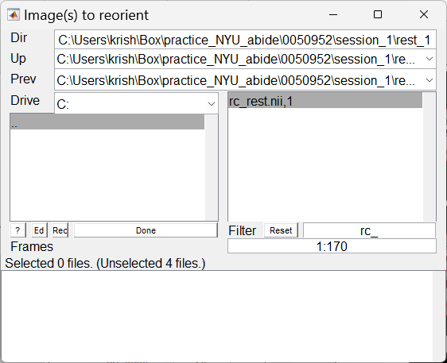
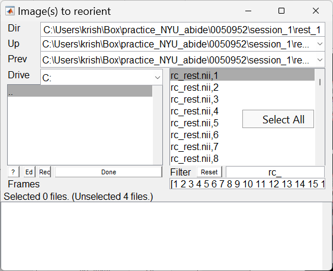
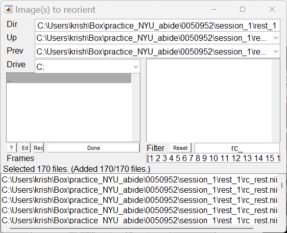

# Tools for Preprocessing

After checking the Quality Control plots the user can use the following tools to improve or redo the preprocessing if there are some errors.

<figure>

<figcaption>
Figure 6‑1: Preprocessing tools
</figcaption>
</figure>

## Determine Framewise Displacement thresholds

> After preprocessing, based on the motion thresholds, WhiFuN skips preprocessing steps for the subjects that had excessive motion. Thus, it may be possible that not all the subjects were preprocessed. However, the Realignment step will be done for all the subjects that were selected and the rp\_\<functional_image_name\>.txt file will be generated for every subject in the functional folder. The user can see how many subjects were rejected and the reason for the rejection by using the Determine Framewise Displacement thresholds button. Once the button is clicked, a GUI shown in *Figure 6‑2* opens up. This shows the Maximum FD, the Mean FD, the percentage of FD greater than 0.2 for every subject and the corresponding histograms along with the thresholds used. Using the Drop down.

Figure 6‑2: Determine the Framewise Displacement thresholds.

> If a Participant is rejected as it did not pass the threshold then the subject ID and the reason why it would be rejected will be shown in the gray text box (*See Figure 6‑4*).
>
> Based on this the user can decide what threshold to keep such that optimal number of participants can be rejected. Once the optimal thresholds are decided then the user must use these new thresholds and run the preprocessing again. The user should make sure that the Overwrite existing files checkbox is not checked (See Figure *6‑3*). WhiFuN will run the preprocessing with the new thresholds, if the preprocessing was already completed for subjects, WhiFuN will skip the preprocessing corresponding to those subjects.

Figure 6‑3 Ensure the Overwrite existing files is unchecked.

Figure 6‑4 Subject Rejected as it exceeded the Max FD threshold.

## Manually Coregister Subjects

> If the User observes that the coregistration corresponding to few subjects is not proper (See Section 5.4) then those can be manually coregistered using this module. Once the user clicks the manually coregister subjects button, a file explorer will pop asking the user to select the subject folder corresponding to the subject that has bad coregistration (Figure *6‑5*)

Figure 6‑5: Select Subject folder that has bad coregistration.

> Once the subject folder is selected, WhiFuN will prompt that the preprocessing files created after realignment steps (if exist) will be deleted. Since the Coregistration have to be performed, the preprocessing has to be redone. Once the user clicks the Yes button, WhiFuN will delete all the preprocessing that are not required and open the SPM manual coregistration module.
>
> Figure 6‑6: The SPM coregistration module pops up when the Subjects are selected to manually coregister.
>
> The user can manually enter the amount of translation or rotation required so that the contour of the functional image aligns with the anatomical image.

<figure>

<figcaption><blockquote>

Figure 6‑7: Users can manually enter the amount of translation or rotation required to align the contour of the functional image to the anatomical image.

</blockquote></figcaption>
</figure>

> Once the contours are aligned, the user should click the Apply to image button, which will open an SPM pop up (See *Figure 6‑8*) .

<figure>

<figcaption>
Figure 6‑8: SPM pop up to apply the manual coregistration to the images
</figcaption>
</figure>

> The user must select the realigned images that start with prefix ‘r’ if the user has also discarded some initial volumes the file name will be rc\_\<functional_image_name\>.nii, else it will be r\<functional_image_name\>.nii. (in this example, \<functional_image_name\> = rest). Based on the preprocessing steps the prefix can be given to the filter as follows

<figure>

<figcaption><blockquote>

Figure 6‑9: Enter the prefix of the Realigned file as filter to just select the Realigned files. Prefix = r, if no initial volumes were discarded, elseif initial volumes were discarded Prefix = rc_ (default and also shown here)

</blockquote></figcaption>
</figure>

> It is essential to select all the functional volumes/time points, for that enter the array of volumes that has to be coregistered. In our example dataset, there are 170 time points or volumes so the array will be 1:170, In general if there are nt time points the array will be 1:nt (*See Figure 6‑10*).

<figure>

<figcaption>
Figure 6‑10: Selecting all the time points/volumes.
</figcaption>
</figure>

Then the user can use the right mouse click and select all the time points/volumes.

<figure>

<figcaption>
Figure 6‑11: Select all time points/volumes.
</figcaption>
</figure>

> Once all the files are selected, click on done and SPM will ask to save the transformation matrix (reorientation matrix), it is always advisable to save this matrix. Click yes and save the matrix in the functional folder of that subject and SPM will coregister the files.

<figure>

<figcaption>
Figure 6‑12: Finally Click on Done to coregister the images.
</figcaption>
</figure>

The user must ensure that the overwrite existing files check box is not checked and run the preprocessing again after this.

Figure 6‑13 Ensure the Overwrite existing files checkbox is unchecked.

## Delete Preprocessing Files from a Particular Step

> If the user finds that the preprocessing was not done properly for a particular step and wishes to redo the preprocessing from that step, this module can be used. When the user clicks on Delete Preprocessing Files from a Particular Step, A GUI pops up (See Figure *6‑14*).

Figure 6‑14: Delete Preprocessing files from a Particular step GUI.

> The user will first select the participants for which the files have to be deleted and then the step after which the files must be deleted. For instance, the following Figure *6‑15* shows how all preprocessing files after CSF Masks (Including CSF Masks) are deleted for two subjects.

Figure 6‑15: Delete Preprocessing files from a Particular step. Figure shows how preprocessing files generated during and after CSF Masks corresponding to two subjects can be deleted
