
# Quality Control

Once the preprocessing is complete, the user is recommended to use the QC viewer to check the quality control plots generated after most preprocessing steps. After preprocessing is completed the *QC viewer* button will open the interactive QC viewer. The quality control plots that are saved in \<Output_folder_path\>/Quality_Control are accessed here.

| 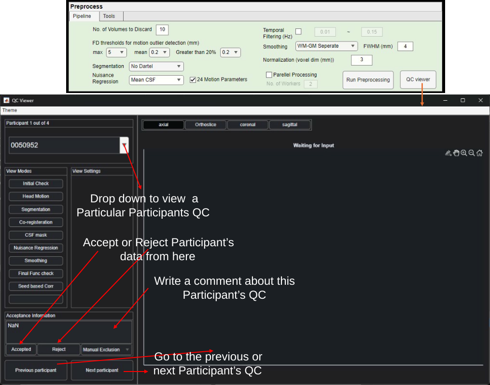 |
|:--:|
| Figure 5‑1: Interactive QC viewer that makes viewing the QC plots very easy and participants can be accepted or rejected within the QC viewer GUI and appropriate comments can be saved. |

## Initial Check

> The raw anatomical and functional images are stored in the a_Initial_check folder with the image contours on the standard MNI reference template for every subject. The user must check the initial position and orientation of the images with that of the MNI space. If the anatomical image is far from the MNI template or orientated differently, then the user must reorient the image manually to the template direction and reset the origin to the anterior commissure (Di & Biswal, 2023).
<table>
<colgroup>
<col style="width: 100%" />
</colgroup>
<thead>
<tr>
<th>
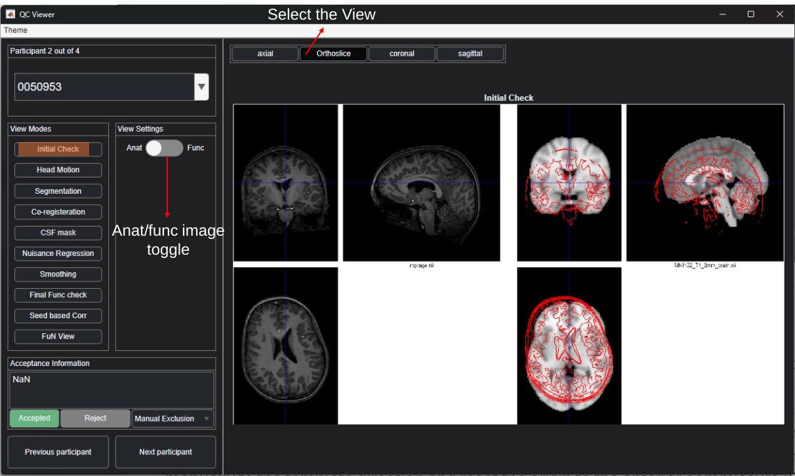

Figure 5‑2: Initial Check Quality Control. The raw anatomical image and its contours plotted on the standard MNI template 
</th>
</tr>
</thead>
<tbody>
</tbody>
</table>

## Head Motion

> The Head Motion button will show the image that contains a subplot with the following visualizations (See Figure *5‑3*): This image is saved in b_Head_motion folder.

<table>
<colgroup>
<col style="width: 100%" />
</colgroup>
<thead>
<tr>
<th>
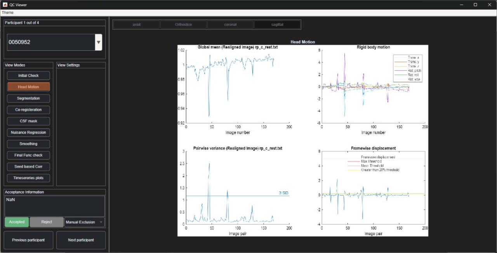

Figure 5‑3: Head motion quality control plot.
</th>
</tr>
</thead>
<tbody>
</tbody>
</table>

1)  Global BOLD Signal – Displays the overall BOLD signal across time.

2)  Motion Parameters – Shows the translational and rotational motion parameters.

3)  Pairwise Variance of the Global BOLD Signal – Illustrates variations in the global signal over time.

4)  Framewise Displacement – Computed using the equation provided in Section 4.2, this plot quantifies subject movement between consecutive volumes. This plot also shows the thresholds use for head motion.

> These plots allow the user to understand why WhiFuN rejected certain subjects. By default, WhiFuN automatically excludes subjects with excessive motion, requiring no additional action from the user.
>
> It can be observed from the Figure *5‑3* that the spikes in the global signal correspond to the spikes in the motion parameters. This is the reason why the motion parameters are regressed out from every voxel timeseries (See section 4.4).
>
> Additionally, a excluded\_\<Subject_ID\>\_.txt file is saved for each rejected subject, indicating the specific FD time points that exceeded the threshold, leading to the rejection.

## Segmentation

> The Segmentation button shows the Segmentation plots for the selected participant. This image is saved in the c_Segmentation folder.
>
> Figure 5‑4: Segmentation Quality Control Plot. Gray Matter (Red), White Matter (Green) and Cerebrospinal Fluid (Blue) overlapped in the MNI space and its contour plotted on the standard MNI template.
>
> WhiFuN shows the segmentation outputs with the GM, WM and CSF probabilities overlapped on the same image in red, green and blue colors respectively. It also draws the contour of the segmentation output on the reference MNI space to check if the alignment of the normalized anatomical image with respect to the MNI template is correct. Users must observe the images for each subject and note any misclassification of the tissues. If any of the tissues are misclassified, then that subject may be discarded. Also, if brain lesions or image quality issues are noticed in the anatomical image, this participant's data should be discarded (Figure *5‑4*).
>
> Figure 5‑5 shows the participants data that might be rejected. For this participant, there is CSF between the skull and the brain which can be due to bad brain extraction. In these cases, the registration to MNI space also includes the CSF, which makes the brain of this participant smaller than that of the MNI space leading to misalignment (See Section 5.8 for more details).

| 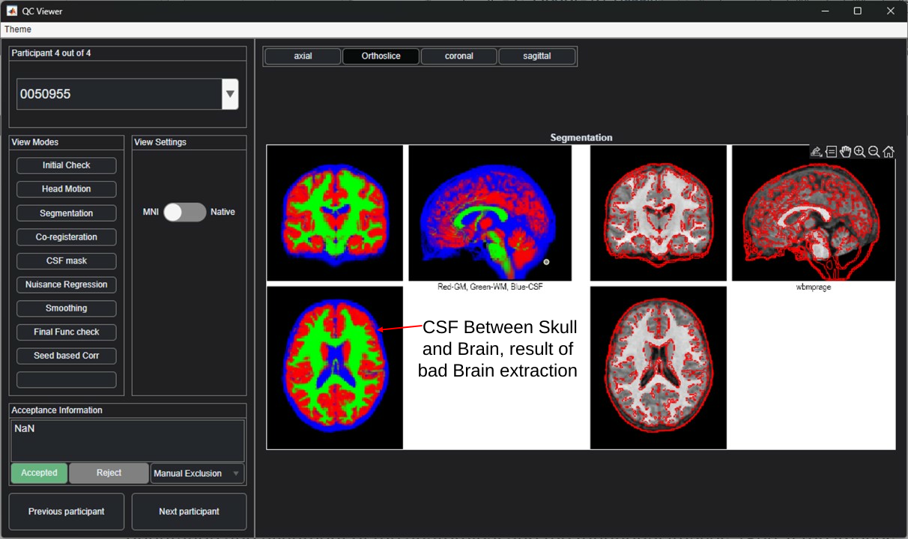 |
|:--:|
| Figure 5‑5: Segmentation for a participant whose data may be rejected. |

## Coregistration

> The Co-registration button shows the anatomical to functional image co-registration. This image is saved in the d_Co_registration folder.
>
> The anatomical image is shown with the functional image (See Figure *5‑6*), and the contour of the anatomical image is overlayed on the functional image in red. The user must check the orientation and alignment of the anatomical and the functional images.
>
> Figure 5‑6 Coregistration Quality plot.
>
> Figure 5‑7 shows the co-registration for the participant that had CSF in between the skull and the brain. It can be observed that brain extraction was not good for this participant. For this participant’s data thus the images are not aligned, the user may reject the data for this participant.

| 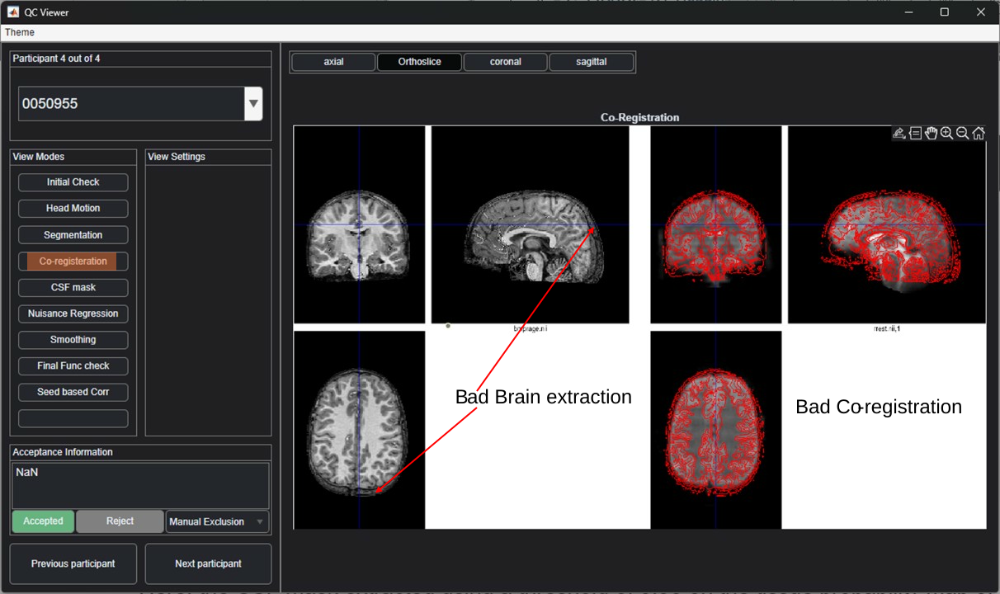 |
|:--:|
| Figure 5‑7: Co-registration plot that maybe rejected. |

## Cerebrospinal Fluid Masks

> The CSF Masks button will show the CSF mask that is used for regression in the next step. This image is stored in e_CSF_Masks_for_Regression folder.
>
> Figure 5‑8: CSF mask plotted and the contour of the CSF mask overlapped on the functional image.
>
> Here, the CSF mask extracted using a threshold of 0.95 on the tissue probability map of CSF is plotted with the functional image along with the contour of the CSF mask on the func image. The user must check the alignment of the CSF mask and the func image. It is observed in some cases that no voxels satisfy the 0.95 threshold. In such cases, the anatomical image must be rechecked, and the user may discard this subject.

## Effects of Regression

> The Nuisance regression button has a variety of QC plots that can be used. These plots are recommended to be a reference to back trace the preprocessing error if found and is not recommended to check for every participant.

### 5.6.1 Global

> The global (average) signal before and after regression of the motion parameters and the CSF signals is plotted. The user may observe that any upward or downward trends and artifacts due to motion are removed after regression.

| 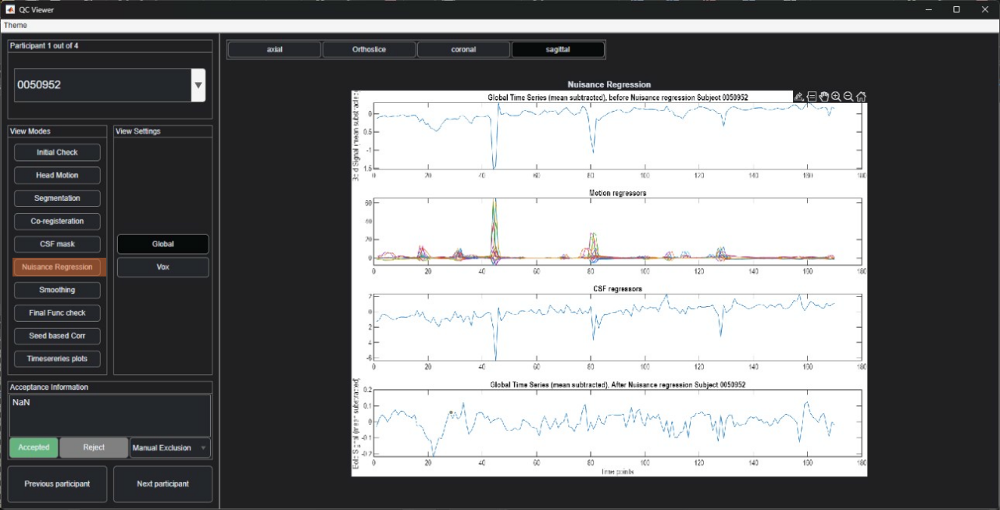 |
|:--:|
| Figure 5‑9 Regression Global Quality Control plot |

### 5.6.2 Vox plots

> **Before Regression**
>
> The vox plot plots all the Framewise displacement and voxel time series before regression together. The time series belonging to the GM is plotted first, the superficial WM (WM close to GM) is plotted next, the deep WM is plotted after that and finally the time series corresponding to CSF is plotted as recommended by (Power et al., 2014).

| 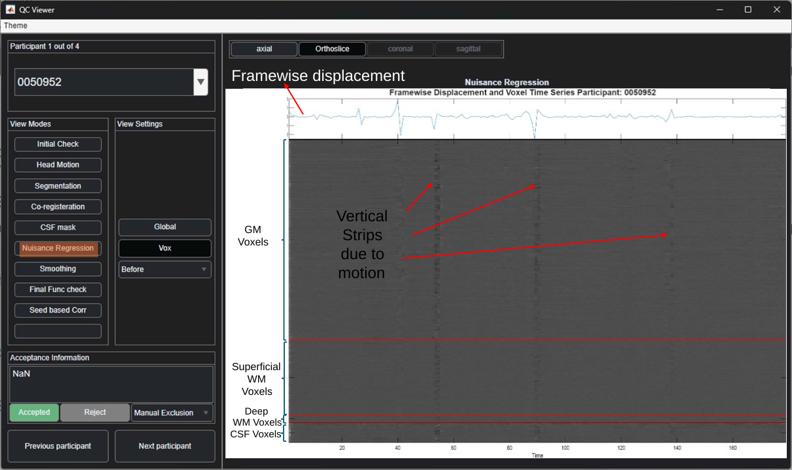 |
|:--:|
| Figure 5‑10: Vox plot before regression |

> **After Regression:**
>
> The vox plot after regression is plotted below (Figure 5‑11). It can be seen using the drop down in the QC_viewer GUI. It can be seen that the vertical stripes seen in Figure 5‑10 are no longer visible. This shows that the regression worked well.

| 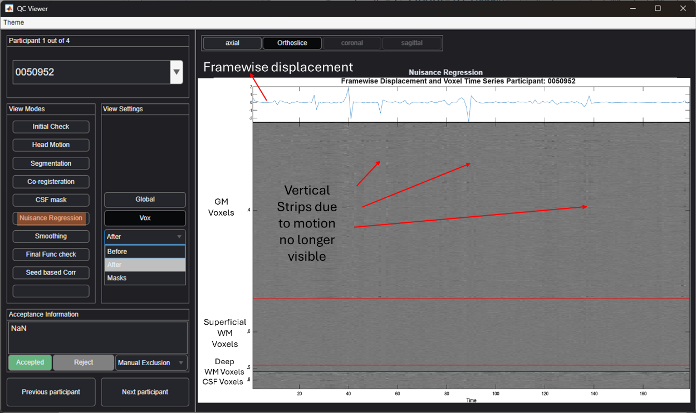 |
|:--:|
| Figure 5‑11: Vox plot after regression |

### 5.6.3 Masks for Vox Plot

> The masks used to identify the GM (Red), Superficial (Green) and deep WM (Yellow), and CSF (blue) can be viewed by clicking on the Masks option from the drop down. Also showing the axial view for this image, to better visualize the plot.

<table>
<colgroup>
<col style="width: 100%" />
</colgroup>
<thead>
<tr>
<th style="text-align: center;"><blockquote>

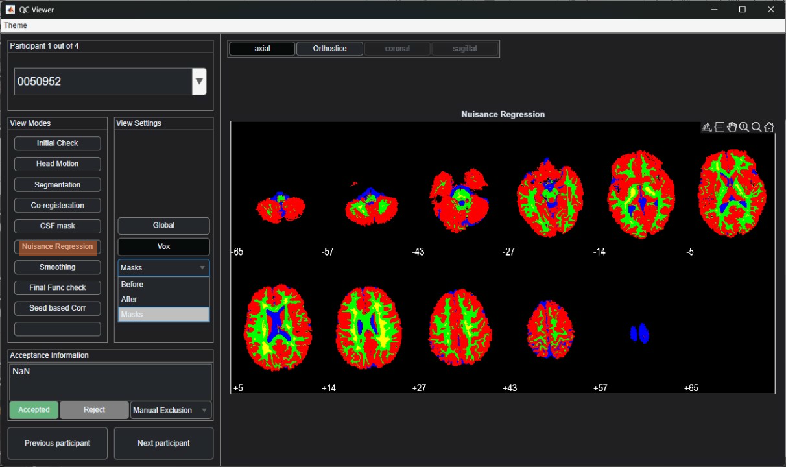

</blockquote></th>
</tr>
</thead>
<tbody>
<tr>
<td style="text-align: center;">Figure 5‑12: Masks for identifying the tissues in vox plot</td>
</tr>
</tbody>
</table>

## Effects of Smoothing

> If Smoothing button is clicked, the smoothing image saved at h_Smoothing folder will be shown.

Figure 5‑13: GM-WM smooth separately QC image

> One may observe that when the GM and WM voxels are smoothed separately, the cortex gets a number of small holes as these voxels were neither identified as GM nor WM. The accuracy of segmentation depends on the resolution of the anatomical and the func images. If the user observes many holes in the cortex, the participant data may have to be discarded. Again, these plots are recommended to be a reference to back trace the preprocessing error if found and is not recommended to check for every participant.

## Final Func QC plots

### 5.8.1 MNI registration check

> If the final func check button is clicked, the normalized functional image is plotted with the reference MNI template image with the contour of the normalized func on the reference MNI template is shown. This image is stored in i_Final_func_MNI folder. The user must ensure that the spatial alignment of the normalized func image with that of the MNI template is correct.

<table>
<colgroup>
<col style="width: 100%" />
</colgroup>
<thead>
<tr>
<th style="text-align: center;">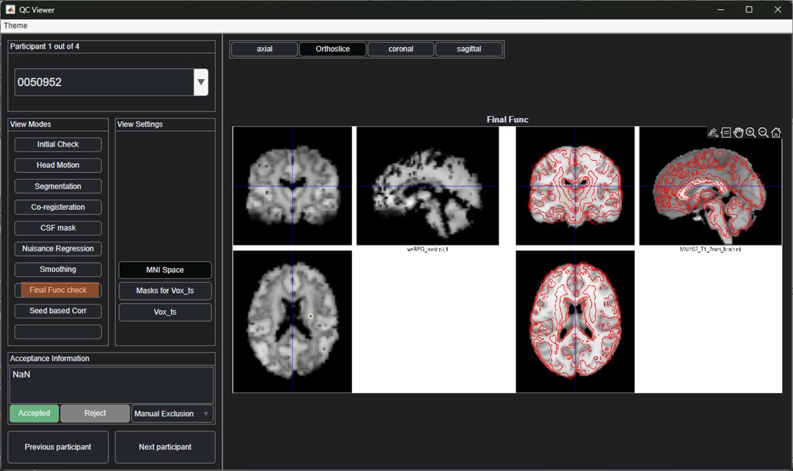</th>
</tr>
</thead>
<tbody>
<tr>
<td style="text-align: center;"><blockquote>

Figure 5‑14: Final func MNI registration check QC plot.

</blockquote></td>
</tr>
</tbody>
</table>

> Below we can see the MNI registration of the participant that had a bad brain extraction (see Section 5.3). The brain appears to be misaligned here. This participant data might be rejected or the user may follow the steps in Section 5.4 to manually coregister and rerun the preprocessing for this subject.

<table>
<colgroup>
<col style="width: 100%" />
</colgroup>
<thead>
<tr>
<th style="text-align: center;">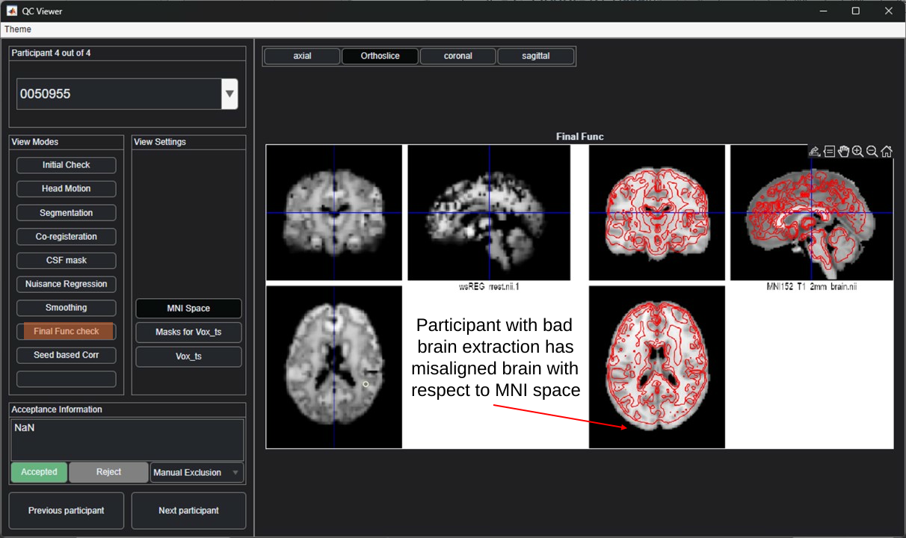</th>
</tr>
</thead>
<tbody>
<tr>
<td style="text-align: center;"><blockquote>

Figure 5‑15: Final func bad MNI registration.

</blockquote></td>
</tr>
</tbody>
</table>

### 5.8.2 Vox plots

> The vox plot for the final normalized image in the MNI space is shown below. The user must look for the vertical stripes (refer to (Power et al., 2014) for more details).

<table>
<colgroup>
<col style="width: 100%" />
</colgroup>
<thead>
<tr>
<th style="text-align: center;"><blockquote>

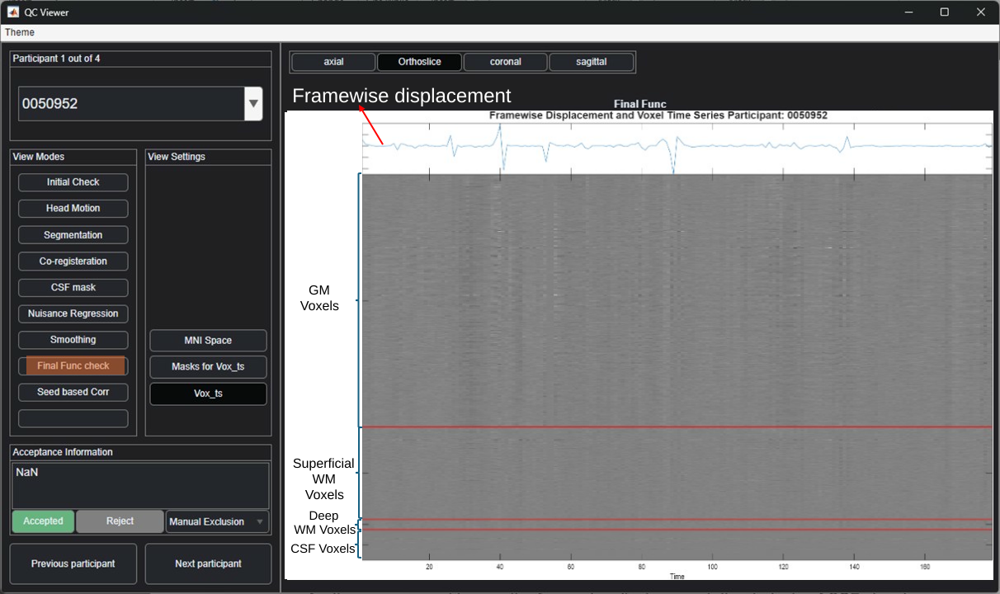

</blockquote></th>
</tr>
</thead>
<tbody>
<tr>
<td style="text-align: center;">Figure 5‑16: Vox plot for the final normalized image in MNI space.</td>
</tr>
</tbody>
</table>

<table>
<colgroup>
<col style="width: 100%" />
</colgroup>
<thead>
<tr>
<th style="text-align: center;"><blockquote>

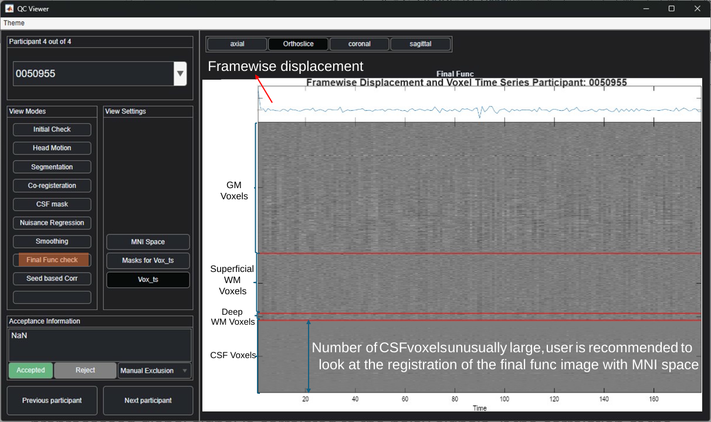

</blockquote></th>
</tr>
</thead>
<tbody>
<tr>
<td style="text-align: center;">Figure 5‑17: Vox plot having unusually large number of CSF voxels</td>
</tr>
</tbody>
</table>

> Another way to recognize if the participant data is good or not, is to look at the amount of CSF voxels. In the below example, (of the participant that had bad skull stripping) it can be observed that the number of CSF voxels is unusually large, (even larger than the number of WM voxels). It is recommended that the user should look at the, MNI registration for this participant (See Section 5.8.1 ) and Segmentation plots for this participant’s data (See Section 5.3 for more details). Accordingly, the user may decide to reject or keep the participant’s data for further analysis.

### 5.8.3 Seed based Correlation plots

> As recommended by (Taylor et al., 2024), 3 seed locations, one in the Default mode Network (left hemisphere, MNI (5,-49,40)), one in the visual network (Right hemisphere, MNI (4,-91,-3)) and one in the auditory network (Left hemisphere, (MNI 64,-12,2)) are considered. A sphere of 6mm radius is drawn around each of the seed voxels, and the average bold signal is extracted. Then the average bold signal from the seed is correlated with all the voxels in the brain for every participant. Finally, the seed-based correlation maps are stored in the func folder as

1)  *seed_corr_map_Seed_lh_cort_aud_64\_-12_2\<func file\>* :- Auditory network Seed based correlation map. \<func file\> the func file used to create the seed map.

2)  *seed_corr_map_Seed_rh_cort_vis_4\_-91_3\<func file\>* :- Visual network Seed based correlation map. \<func file\> the func file used to create the seed map.

3)  *seed_corr_map_Seed_lh_pcc_5\_-49_40\<func file\>* :- Default network Seed based correlation map.

> \<func file\> the func file used to create the seed map.
>
> For each of these maps the axial, coronal and sagittal views for different slices are saved as .png images in k_Seed_Based_Corr folder in the *quality_control* folder. For the QC check the user may directly click the *Seed based Corr* button and view the seed based plots.

| 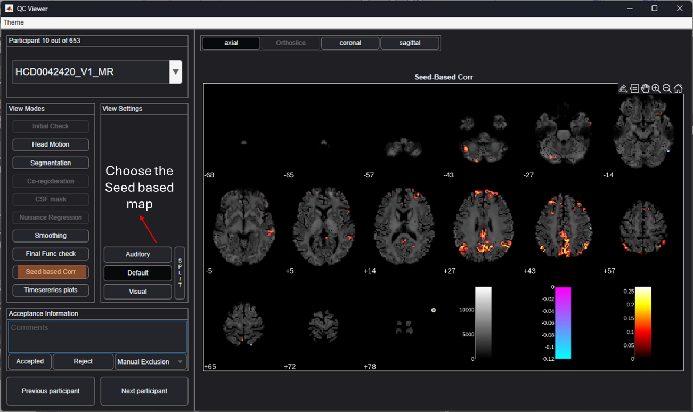 |
|:--:|
| Figure 5‑18: Default mode Network Seed based Correlation QC map. |

> It is recommended that the user look at these maps for every participant. To watch all the seed-based plots along with the vox plot, the split button can be used (See Figure 5‑19).

| 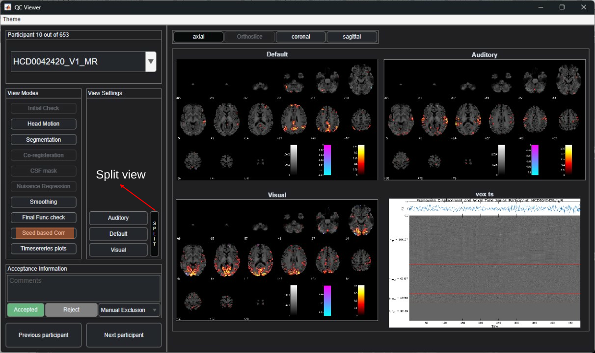 |
|:--:|
| Figure 5‑19: Split view in Seed Based Corr plots. |

> The users are recommended to check for any seed plots that are correlated to every voxel in the brain or have some artifact correlation patterns. Figure 5‑19, Figure 5‑20 are expected seed-based correlation and vox plots.

| 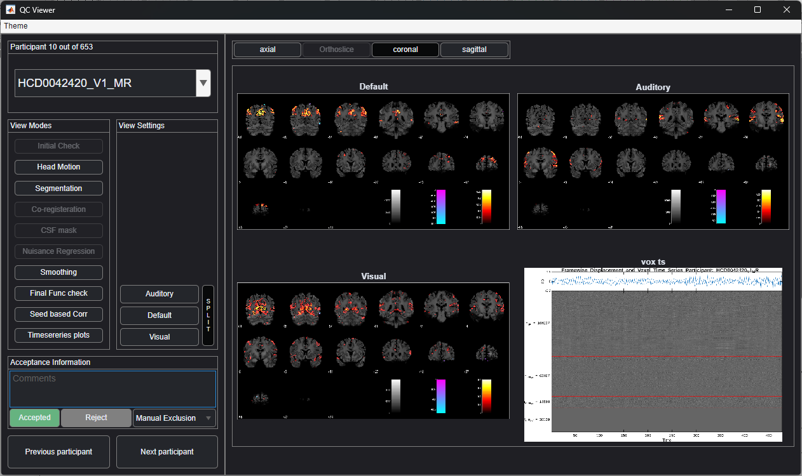 |
|:--:|
| Figure 5‑20: An expected seed-based correlation and vox plot. |

> Figure 5‑21and Figure 5‑22 shows a participant data with artifacts. In Figure 5‑21 a weird strip like pattern can be seen in the default mode network seed correlation plot and in Figure 5‑22, every voxel seems to be correlated with every other voxel. Data corresponding to these participants is recommended to be excluded from further analysis.

| 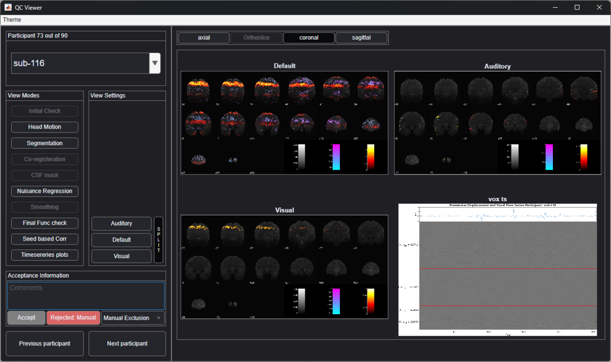 |
|:--:|
| Figure 5‑21: Participant data with artifacts, default mode network pattern looks very weird. |

| 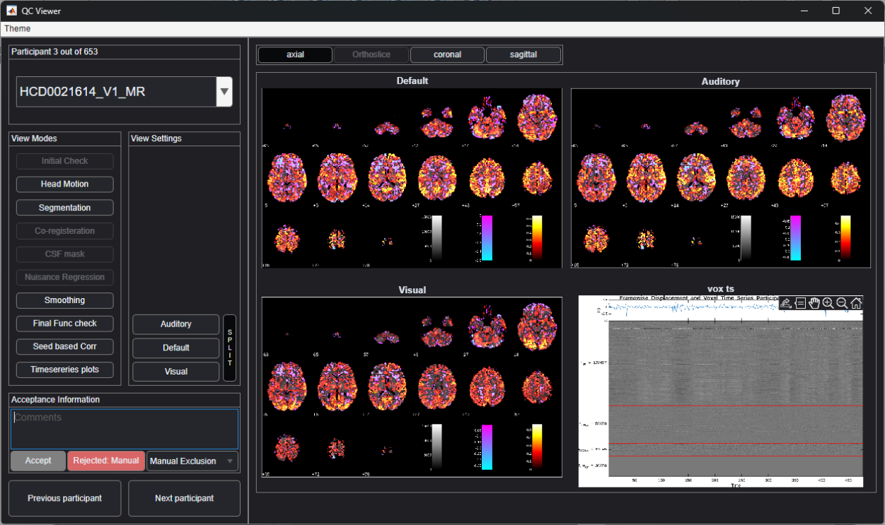 |
|:--:|
| Figure 5‑22: The seed-based correlation plots have almost every voxel correlated. |

## Time-Series Check

> The user can observe the associations between the global and noisy signals at this step. WhiFuN plots the raw unprocessed global signal, the six rigid motion parameters computed during realignment, the CSF signals, the global mean of the preprocessed image, and the correlation of all the above-mentioned signals. WhiFuN also plots pairwise variance between consecutive volumes (similar to DVARS (Power et al., 2014)) for the unprocessed image, the framewise displacement, the derivate of CSF signals, the pairwise variance between consecutive volumes for the preprocessed image and the correlation of these signals. The user must check the correlation plots and observe if the preprocessed global signal is correlated to the noisy signals. If the correlation of the global signal corresponding to the final preprocessed signal with any of the noisy signals is significant, the user may exclude the subject.

Figure 5‑23 **:** Timeseries plot showing the global time series before preprocessing, the 6 motion parameters, the mean CSF time series, the global mean signal after preprocessing and a correlation matrix correlating these signals. The same is repeated for pairwise variance across consecutive scans instead of the global mean in the 2nd row.

It is recommended that the user examines all QC plots of all the preprocessing steps to remove participant data that has artifacts from further analysis.
