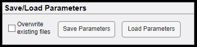

# Save/Load Parameters

## Overwrite Existing files

> This checkbox can be used to overwrite any previous files created during preprocessing.
>
> If overwrite existing files checkbox is unchecked, WhiFuN will check if any preprocessing files already exist and skip preprocessing for these files.
>
> If overwrite exiting files checkbox is checked, WhiFuN will delete any previously created preprocessing files (if they exist) and start the preprocessing from the start for every subject.

## Load Parameters

> Once WhiFuN is closed and a new session is open at a later date, the Load Parameters option can be used to fill all fields as it was when the first session was open.
>
> After the user does the Run Data Check, a parameters.mat file is saved in the output folder. This file contains all the parameters used for preprocessing and setting up the data paths. Users can load this parameter and get all the fields populated.

## Save parameters

> Alternatively, users can also save the parameters at a different place or overwrite any other parameter.mat file using the Save parameters button.

<figure>

<figcaption>
Figure 10‑1: Save/Load Parameters
</figcaption>
</figure>
