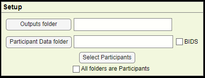
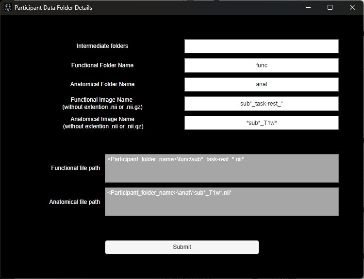

<a id="setup"></a>
# Setup

> The Folder paths for where the MRI data is stored and where the outputs of WhiFuN will be stored are provided in the Setup.



<a id="output-folder"></a>
## Output Folder

> Output Folder is an **empty** folder where the quality control plots and results of WhiFuN will be stored.
>
> Click the Outputs folder button or alternatively paste the path of the Outputs folder in the text box besides the Output folder button. This will be referred to as Output_folder_path for the rest of the manual.

<a id="participant-data-folder"></a>
## Participant Data Folder

> Participant Data Folder is where the raw MRI data is present. This folder should contain subfolders that correspond to data of Subjects/Participants. Every subfolder should contain anatomical MRI scan and the fMRI scan.
>
> Similar to the Output folder, the Participant Data Folder path can be specified by clicking the Participant Data folder button or by pasting the path in the text box besides the Participant Data Folder button. Once the Participant Data Folder is selected, WhiFuN will tell the number of folders identified in the Participant Data Folder.
>
> If all the folders inside the Participant Data Folder correspond to a subject, then check the *All folders are Participant* checkbox. Else, the *Select Participants* button can be used to select the folders corresponding to the Subjects/Participants. Once the participants are selected, WhiFuN will show the total number of participants selected.
>
> As an example, the practice data uploaded here (<https://drive.google.com/drive/folders/1l7dhG8dYYRCW5EWhkPZbBpA7TOau1W-B?usp=sharing>) can be used to understand the paths to be given to WhiFuN.

<a id="data-structure"></a>
## Data Structure

> Most fMRI datasets use the Brain Imaging Data Structure (BIDS) (<https://bids.neuroimaging.io/>) . If the dataset that is to be preprocessed and analyzed is in BIDS format, then the checkbox besides the Participants Data Folder should be checked.
>
> If, however, the dataset is not in BIDS format then uncheck the BIDS checkbox. That will open *Participants* *Data Folder Details* window. By default, the fields here are filled for the BIDS format. To use any other data format these fields have to be changed.
>
> 
>
> WhiFuN can process the following deviation from BIDS format

1.  The dataset to be processed should have subject folders and every subject folder should have an anatomical folder which contains the anatomical MRI scan (e.g. T1 weighted scan) and a functional folder which contains the functional MRI scan (e.g. Resting_state scan).

2.  The anatomical and the functional folder should be in the same folder.

> WhiFuN won’t be able to process any dataset that deviates from the above-mentioned format wintin the GUI. However with Script it is possible.
>
> We explain how the deviations from BIDS can be handled by WhiFuN using an example of practice [ABIDE](https://fcon_1000.projects.nitrc.org/indi/abide/) dataset that can be downloaded from [here](https://drive.google.com/drive/folders/1l7dhG8dYYRCW5EWhkPZbBpA7TOau1W-B). It has the following folder structure
>
> Example Data format 1:
>
## Example

```md
├── 0050952
│   └── session_1
│       ├── anat_1
│       │   └── mprage.nii.gz
│       └── rest_1
│           └── rest.nii.gz
├── 0050953
│   └── session_1
│       ├── anat_1
│       │   └── mprage.nii.gz
│       └── rest_1
│           └── rest.nii.gz
├── 0050954
│   └── session_1
│       ├── anat_1
│       │   └── mprage.nii.gz
│       └── rest_1
│           └── rest.nii.gz
└── 0050955
    └── session_1
        ├── anat_1
        │   └── mprage.nii.gz
        └── rest_1
            └── rest.nii.gz
```
>
> practice_nyu_abide Participants Data folder
>
> 0050952 Specific Participant’s Folder
>
> session_1 Intermediate folder
>
> anat_1 Anatomical folder
>
> rest_1 Functional folder
>
> 0050953
>
> session_1
>
> anat_1
>
> rest_1
>
> 0050954
>
> session_1
>
> anat_1
>
> rest_1

0050955

> session_1
>
> anat_1
>
> rest_1
>
> **Fields of *Participants Data Folder Details***
>
> **Intermediate folders:** If there are folders between the *participant* folder and the folder containing the anatomical and functional images then those should be specified here.
>
> In the practice dataset example (example format 1) , the intermediate folder field will have
>
> Intermediate folders: - session_1
>
> Note that if there are sight differences in the intermediate folders across *participants* then the wild card can be used. (For e.g. Session\*).
>
> If there are multiple folders, then the complete path between the *participant* folder and the folder that contains the anatomical and the functional folder should be provided.
>
> For example, if the data has the following structure
>
> Example Data format 2
>
> Practice_nyu_abide
>
> 0050952
>
> MRI
>
> 3T
>
> session_1
>
> anat_1
>
> func_1
>
> 0050953
>
> MRI
>
> 3T
>
> session_1
>
> anat_1
>
> func_1
>
> For example, data format 2 the Intermediate folders field should be
>
> Intermediate folders: - MRI/3T/session_1 (for windows)
>
> or
>
> Intermediate folders: - MRI\3T\session_1 (for Mac or Linux)
>
> Users can also use wild cards (\*).
>
> **Functional Folder Name:** Specify the folder name where the functional file is present.
>
> For example: for both the example data formats, the functional folder name will be
>
> Functional folder name: - func_1
>
> **Anatomical folder name:** Specify the folder name where the anatomical file is present.
>
> For example: for both the example data formats, the anatomical folder name will be
>
> Anatomical folder name: - anat_1
>
> **Functional/Anatomical Image name:** Specify the name of the functional/anatomical image here. Since most datasets have the subject ID included in the functional image name, one would have to use the wild card (\*) here.
>
> Most datasets have the compressed files in the form *.nii.gz*, while others have the *.nii* files. Do not specify the extension in the field, WhiFuN will automatically detect the file and if a *.nii.gz* file is found then it will uncompress it and process the file.
>
> Once all the fields are set, the path of the functional and anatomical images can be seen in the functional and anatomical file path fields. The user must check these paths and then click submit. As the user clicks submit, WhiFuN will check if the given anatomical and functional path works for the first subject, if it does not, then it will say which field it feels can be wrong. The user can do the following changes and try again.
