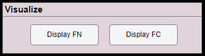
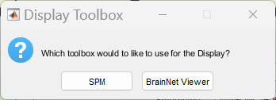
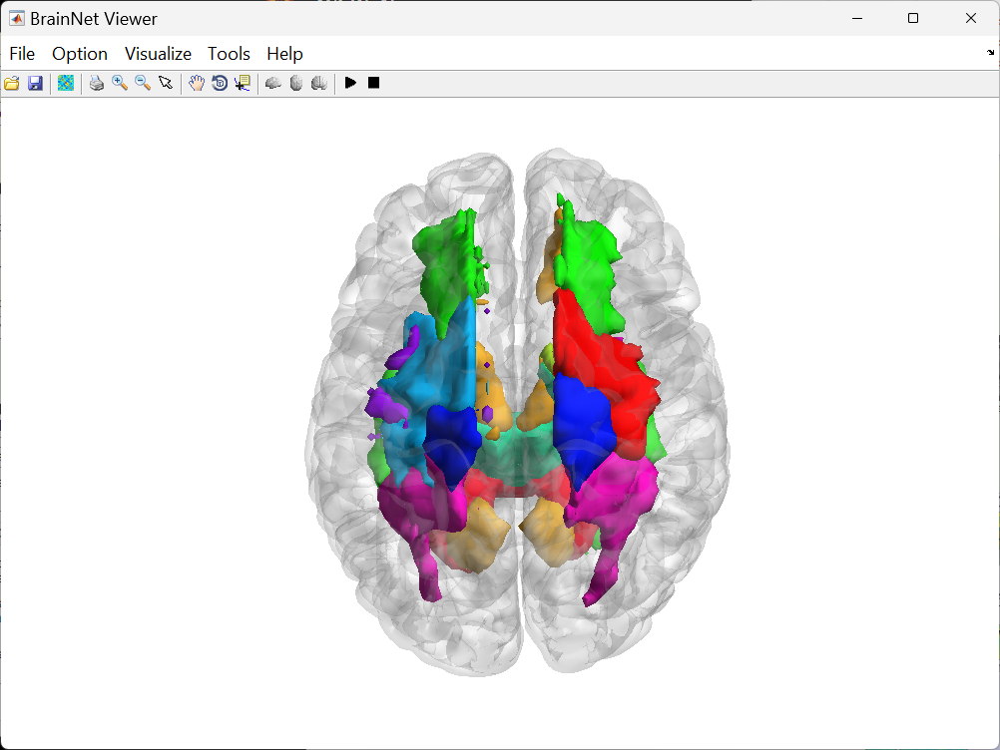
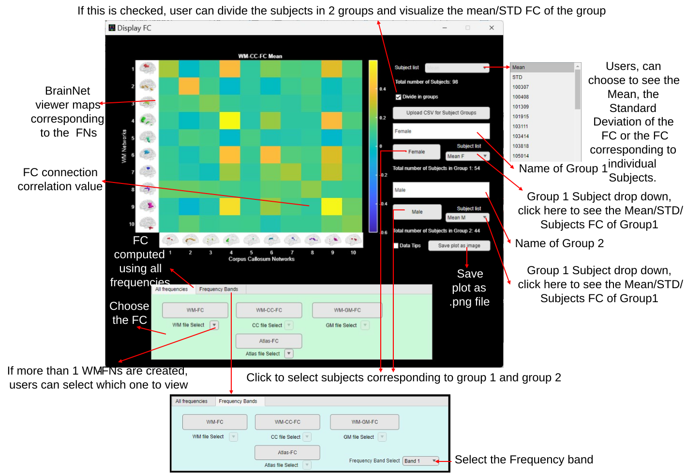

# Visualizations

WM/GM FNs created can be visualized using the *Display FN* module, and the FC matrix can be visualized using the *Display* *FC* module.

<figure>

<figcaption>
Figure 9‑1 WhiFuN Visualize module
</figcaption>
</figure>

## Display FN

> Once the functional networks are created using the details discussed in section 7.3, the networks can be viewed using the Display FN module.
>
> As soon as the user clicks on the Display FN module, WhiFuN asks the user to select the clustering file (.nii file saved after WM/GM FNs are created). If the output folder is mentioned in the Setup, WhiFuN will directly open the WhiFuN Analysis folder. As an example, we show results from the HCP 100 unrelated subjects’ dataset.

Figure 9‑2 Select the FN file to visualize.

> User can choose the desired FN file (.nii or .nii.gz file) to visualize and click open.
>
> WhiFuN can visualize the FN using the SPM display module or BrainNet viewer. WhiFuN will ask which toolbox the user would want to use to display the FN (see Figure *9‑3*).

<figure>

<figcaption>
Figure 9‑3 Which toolbox to use for Display FN.
</figcaption>
</figure>

### 9.1.1 SPM Display FN

> If the user chooses SPM, A plot similar to Figure *9‑4* will be shown for the FN file selected. Users can move the crosshair and use any other SPM display feature here.

Figure 9‑4 SPM display FN

### 9.1.2 BrainNet Viewer Display FN

> If the user chooses BrainNet viewer, A plot similar to Figure *9‑5* will be shown for the FN file selected. Users can use any other features of the BrainNet viewer toolbox to see the plot as desired (For instance See Figure *9‑6*).

<figure>

<figcaption>
Figure 9‑5 BrainNet viewer Display FN
</figcaption>
</figure>

Figure 9‑6: Click on option🡪 option🡪Layout🡪 Full view to see the above-mentioned plot.

## Display FC

> To visualize the FC matrices, the Display FC module can be used. Once the user clicks the Display FC button the Display FC GUI will open.

Figure 9‑7: Display FC module.

Based on the average time series generated (see details in Section 7) the corresponding FC buttons (at the bottom of the GUI) will be enabled. If any of the buttons are not enabled that means WhiFuN did not find the time series corresponding to that particular FC.

**Display FC Module Features**

1)  Subject List drop down: Users can use this drop down to choose to see the Mean, the Standard Deviation of the FC or the FC corresponding to individual Subjects.

2)  Divide in Groups: Users can divide the subjects into two groups and then visualize the mean/STD of the FC from subjects in the group by checking this checkbox.

> If Divide in Groups Checkbox is checked

1)  Upload CSV for Subject Groups: Upload a CSV file with two columns. The First column should be the subject ID (same as that in the Subject Folder), and the second column should have the groups. Only two groups are allowed. So, the unique values that the 2nd column can have should be two. (For instance sex, can be M or F).

2)  Name of group 1or group 2: Users can put any name here, corresponding to Group 1 or Group 2 subjects.

3)  Group 1 or Group 2 subjects select: Alternatively the user can manually select subjects for group 1 and group 2.

<!-- -->

3)  Data Tips: When this is checked, the user can click on an element in the plot and see the corresponding FC value.

4)  Save plot as image: using this the user can save the plot as .png file for publications or posters.

5)  Frequency Bands: Here the output from the Extract timeseries in specific frequency bands (see section 0) can be visualized.

<figure>

<figcaption>
Figure 9‑8 FC Display Module Features
</figcaption>
</figure>
